autoscale: true
theme: helsing, 3
build-lists: true


### ArcShift: Going 10x faster than RwLock

---

# Who am I
[.build-lists: false]

* Name: Anders Musikka
* Engineer at Helsing (We're hiring!)

---

^
NEXT
I've got this little side project, a computer game I'm writing. Part of it involves
3d models which are loaded from blender files. From these blender files, various game assets
are generated, and these assets are used by the game's simulation threads. 
NEXT
I had been using std::Arc to hold on to these
Arc is an "Atomically reference counted", it's a way to safely share an object between many
threads, while avoiding memory leaks.
NEXT
Then I wanted to implement hot reloading. 
NEXT
To do this, I started wrapping my assets in 
Arc<RwLock> instead of just Arc<>.
NEXT

## Problem statement
[.autoscale: false]

* Multithreaded computer game
* Assets shared between threads `Arc<T>`
* Hot-reloading
* Need `Arc<RwLock<T>>`


---

## Problem statement
[.autoscale: false]

[.build-lists: false]

^
For the sake of this presentation, let's illustrate assets with
some 0.2 kilopixel video game graphics.
*pause
Now, let's look at the performance overhead of using RwLock.

* Multithreaded computer game
* Assets shared between threads `Arc<T>`
* Hot-reloading
* Need `Arc<RwLock<T>>`

[.column]


[.column]


[.column]

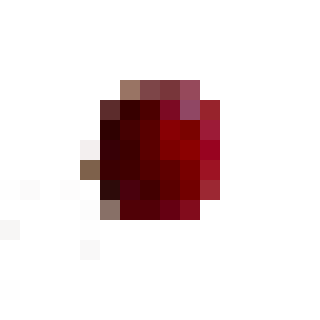


---

^ This is the assembly code of a plain Arc deref.
Talk about perf for RwLock. Promise benchmarks later.

[.column]

Arc read access, assembly:

```text
	mov	rax, qword ptr [rdi]
	add	rax, 16
	ret
```


[.column]

RwLock read access, assembly:

```text
playground::access_arc: # @playground::access_arc
# %bb.0:
	push	r14
	push	rbx
	sub	rsp, 24
	mov	rbx, qword ptr [rdi]
	lea	rdx, [rbx + 16]
	mov	eax, dword ptr [rbx + 16]
	cmp	eax, 1073741821
	ja	.LBB2_2
# %bb.1:
	lea	ecx, [rax + 1]
                                        # kill: def $eax killed $eax killed $rax
	lock		cmpxchg	dword ptr [rdx], ecx
	jne	.LBB2_2
# %bb.3:
	movzx	eax, byte ptr [rbx + 24]
	add	rbx, 32
	test	al, al
	jne	.LBB2_4

.LBB2_9:
	mov	rax, rbx
	add	rsp, 24
	pop	rbx
	pop	r14
	ret

.LBB2_2:
	mov	rdi, rdx
	mov	r14, rdx
	call	qword ptr [rip + std::sys::sync::rwlock::futex::RwLock::read_contended@GOTPCREL]
	mov	rdx, r14
	movzx	eax, byte ptr [rbx + 24]
	add	rbx, 32
	test	al, al
	je	.LBB2_9

.LBB2_4:
	mov	qword ptr [rsp + 8], rbx
	mov	qword ptr [rsp + 16], rdx
	lea	rdi, [rip + .Lanon.436ae9267b82744b9242521d782cd7f5.1]
	lea	rcx, [rip + .Lanon.436ae9267b82744b9242521d782cd7f5.0]
	lea	r8, [rip + .Lanon.436ae9267b82744b9242521d782cd7f5.4]
	lea	rdx, [rsp + 8]
	mov	esi, 43
	call	qword ptr [rip + core::result::unwrap_failed@GOTPCREL]
# %bb.5:
	ud2
	mov	rbx, rax
	mov	rdi, qword ptr [rsp + 16]
	mov	esi, -1
	lock		xadd	dword ptr [rdi], esi
	dec	esi
	mov	eax, esi
	and	eax, -1073741825
	neg	eax
	jo	.LBB2_7

.LBB2_8:

```


---


## Data layout of Arc<T>

^
Let's look at the data-layout of std Arc
It's a pointer to a heap block with two counters.

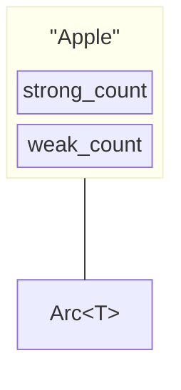
```mermaid
block-beta
  columns 1
  block:I
    columns 1
    uct("<div style="display:flex; justify-content: flex-start; align-items:flex-end;">&quot;Apple&quot;</div>"):1
    columns 1
    strong_count
    weak_count
  end
  block:J 
    columns 1
    space
    D["Arc&lt;T&gt;"]
  end
  D --- I
class uct,J BT
classDef BT stroke:transparent,fill:transparent

```

---
[.autoscale: false]


^


```mermaid
block-beta
  columns 1
  block:I
    columns 1
    uct("<div style="display:flex; justify-content: flex-start; align-items:flex-end;">&quot;Apple&quot;</div>"):1
    columns 1
    strong_count
    weak_count
  end
  block:J 
    columns 1
    space
    D["Arc&lt;T&gt;"]
  end
  D --- I
class uct,J BT
classDef BT stroke:transparent,fill:transparent

```


[.column]


[.column]
➡

[.column]


---
[.autoscale: false]


^
Now, what if we could just add a 'next'-pointer to the inner value of Arc?
When we want to make an updated value available, we just set the next-pointer to this new value!
Let's assume that a game designer is changing the 'apple' graphic to a 'banana' graphic.

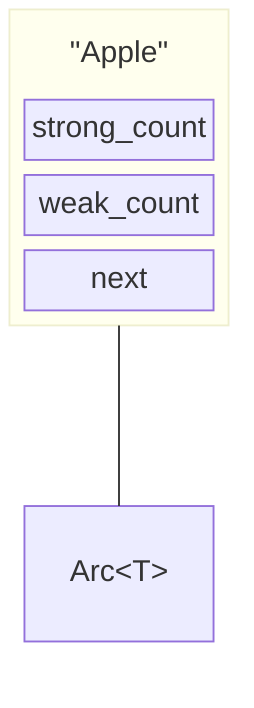
```mermaid
block-beta
  columns 1
  block:I
    columns 1
    uct("<div style="display:flex; justify-content: flex-start; align-items:flex-end;">&quot;Apple&quot;</div>"):1
    columns 1
    strong_count
    weak_count
    next
  end
  block:J 
    columns 1
    space
    D["Arc&lt;T&gt;"]
  end
  D --- I
class uct,J BT
classDef BT stroke:transparent,fill:transparent

```


[.column]


[.column]
➡

[.column]


---
^
We set the next-pointer to point to the "Banana"

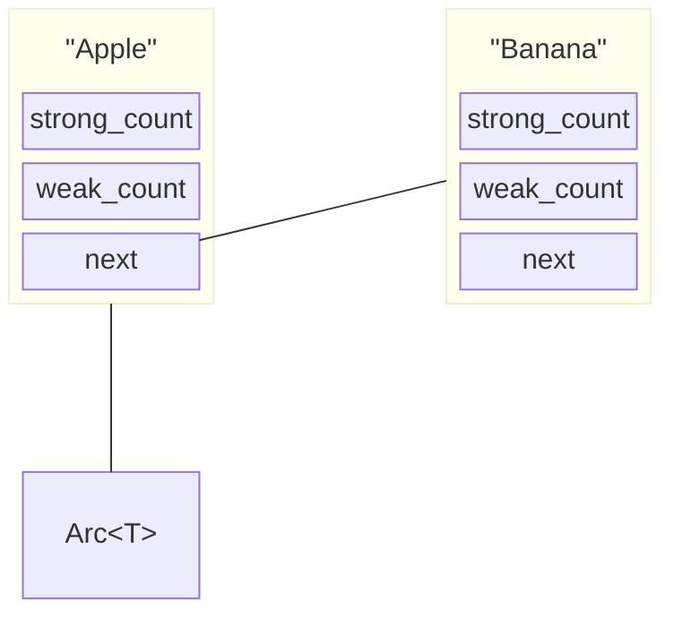
```mermaid
block-beta
  columns 3
  block:I
    columns 1
    uct("<div style="display:flex; justify-content: flex-start; align-items:flex-end;">&quot;Apple&quot;</div>"):1
    columns 1
    strong_count
    weak_count
    next
  end
  space
  block:I2
    columns 1
    uct2("<div style="display:flex; justify-content: flex-start; align-items:flex-end;">&quot;Banana&quot;</div>"):1
    columns 1
    strong_count2["strong_count"]
    weak_count2["weak_count"]
    next2["next"]
  end
  block:J 
    columns 1
    space
    D["Arc&lt;T&gt;"]
  end
  space
  space
  D --- I
  next --- I2
class uct,uct2,J BT
classDef BT stroke:transparent,fill:transparent

```


---


^
This kinda works, but who deallocates 'Apple'?
We could say that the last access should deallocate the node, but it's not always so easy.

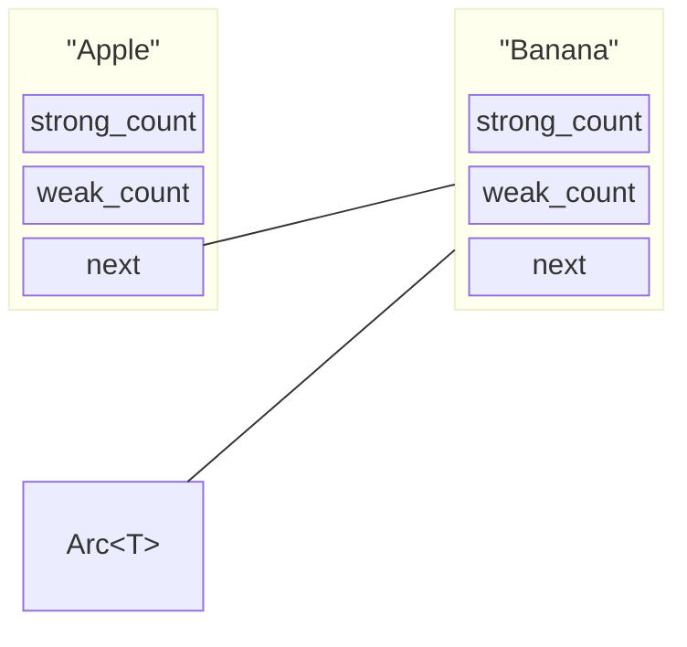
```mermaid
block-beta
  columns 3
  block:I
    columns 1
    uct("<div style="display:flex; justify-content: flex-start; align-items:flex-end;">&quot;Apple&quot;</div>"):1
    columns 1
    strong_count
    weak_count
    next
  end
  space
  block:I2
    columns 1
    uct2("<div style="display:flex; justify-content: flex-start; align-items:flex-end;">&quot;Banana&quot;</div>"):1
    columns 1
    strong_count2["strong_count"]
    weak_count2["weak_count"]
    next2["next"]
  end
  block:J 
    columns 1
    space
    D["Arc&lt;T&gt;"]
  end
  space
  space
  D --- I2
  next --- I2
class uct,uct2,J BT
classDef BT stroke:transparent,fill:transparent

```


---

^
Let's say you update your object twice.
So at first you had two arc instances (1 and 2) that both shared 'Apple'.


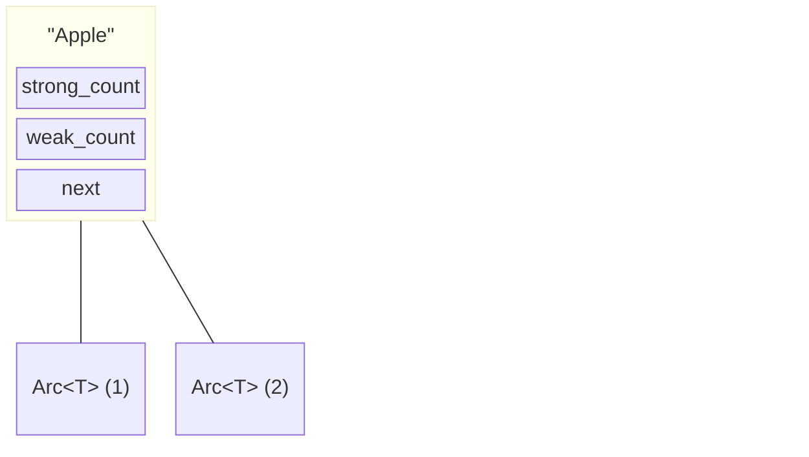
```mermaid
block-beta
  columns 5
  block:I
    columns 1
    uct("<div style="display:flex; justify-content: flex-start; align-items:flex-end;">&quot;Apple&quot</div>"):1
    columns 1
    strong_count
    weak_count
    next
  end
  space:4
  block:J 
    columns 1
    space
    D["Arc&lt;T&gt; (1)"]
  end
  block:J2
    columns 1
    space
    D2["Arc&lt;T&gt; (2)"]
  end
  space
  D --- I
  D2 --- I
class uct,J,J2 BT
classDef BT stroke:transparent,fill:transparent

```

---

^
Then one was updated, so that it became 'Banana'. 


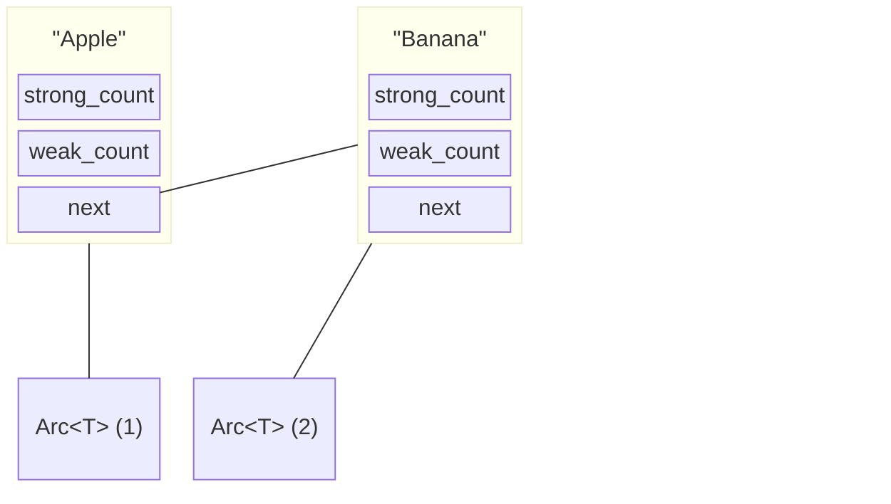
```mermaid
block-beta
  columns 5
  block:I
    columns 1
    uct("<div style="display:flex; justify-content: flex-start; align-items:flex-end;">&quot;Apple&quot</div>"):1
    columns 1
    strong_count
    weak_count
    next
  end
  space
  block:I2
    columns 1
    uct2("<div style="display:flex; justify-content: flex-start; align-items:flex-end;">&quot;Banana&quot;</div>"):1
    columns 1
    strong_count2["strong_count"]
    weak_count2["weak_count"]
    next2["next"]
  end
  space:2
  block:J 
    columns 1
    space
    D["Arc&lt;T&gt; (1)"]
  end
  block:J2
    columns 1
    space
    D2["Arc&lt;T&gt; (2)"]
  end
  space
  D --- I
  next --- I2
  D2 --- I2
class uct,uct2,J,J2 BT
classDef BT stroke:transparent,fill:transparent

```

---


^
Then it was updated again, becoming 'Cranberry'.
We can't delete Apple or Cranberry, because there could be live references. 
However, in principle we could deallocate node 2 (Banana)!
But if we do, how do we know Arc 1 isn't about to follow the 'next' pointer right now?
We could say only the left most object can be deallocated, but then there's no bound to how long this 
chain of objects could become.
This is an instance of the "Memory Reclamation Problem".
We'll take a look at how ArcShift manages to safely delete Banana in this case. 

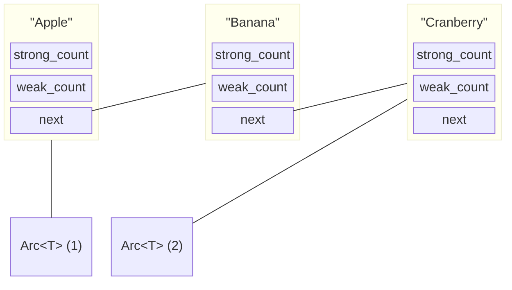
```mermaid
block-beta
  columns 5
  block:I
    columns 1
    uct("<div style="display:flex; justify-content: flex-start; align-items:flex-end;">&quot;Apple&quot</div>"):1
    columns 1
    strong_count
    weak_count
    next
  end
  space
  block:I2
    columns 1
    uct2("<div style="display:flex; justify-content: flex-start; align-items:flex-end;">&quot;Banana&quot;</div>"):1
    columns 1
    strong_count2["strong_count"]
    weak_count2["weak_count"]
    next2["next"]
  end
  space
  block:I3
    columns 1
    uct3("<div style="display:flex; justify-content: flex-start; align-items:flex-end;">&quot;Cranberry&quot;</div>"):1
    columns 1
    strong_count3["strong_count"]
    weak_count3["weak_count"]
    next3["next"]
  end
  block:J 
    columns 1
    space
    D["Arc&lt;T&gt; (1)"]
  end
  block:J2
    columns 1
    space
    D2["Arc&lt;T&gt; (2)"]
  end
  space
  D --- I
  D2 --- I3
  next --- I2
  next2 --- I3
class uct,uct2,uct3,J,J2 BT
classDef BT stroke:transparent,fill:transparent

```


---

## ArcShift

^
Now, back to ArcShift. Let's go through how it works.
NEXT
We add 3 new fields, 'next', 'prev' and 'advance'.
NEXT
Next points to some newer value, or null
NEXT
Prev points to exactly the previous value in the chain
NEXT
Advance is a marker to protect the next node from being deallocated


 * Add 'next', 'prev' and 'advance' fields
 * 'next' must point to some node with a newer value, or null
 * 'prev' always points to previous node in the chain, or null
 * 'advance' incremented before a node dereferences 'next'

---

## ArcShift(cont)

^
ArcShift is built-up around two central algorithms:
'advance' and 'garbage collect'. 
NEXT
These allow detecting and retrieving updated values, and
NEXT
allow deallocating stale values.
Let's look at how 'advance' works. Now, there isn't time to explain this in detail in a lightning talk.
The following just serves to give a feel for the complexity involved.
  
 * Nodes can "advance" by walking 'next'-links to the right-most node
 * Nodes can run "Garbage Collect" to free unused nodes ("Banana" on previous slide)

---

^
start position
this is slightly simplified

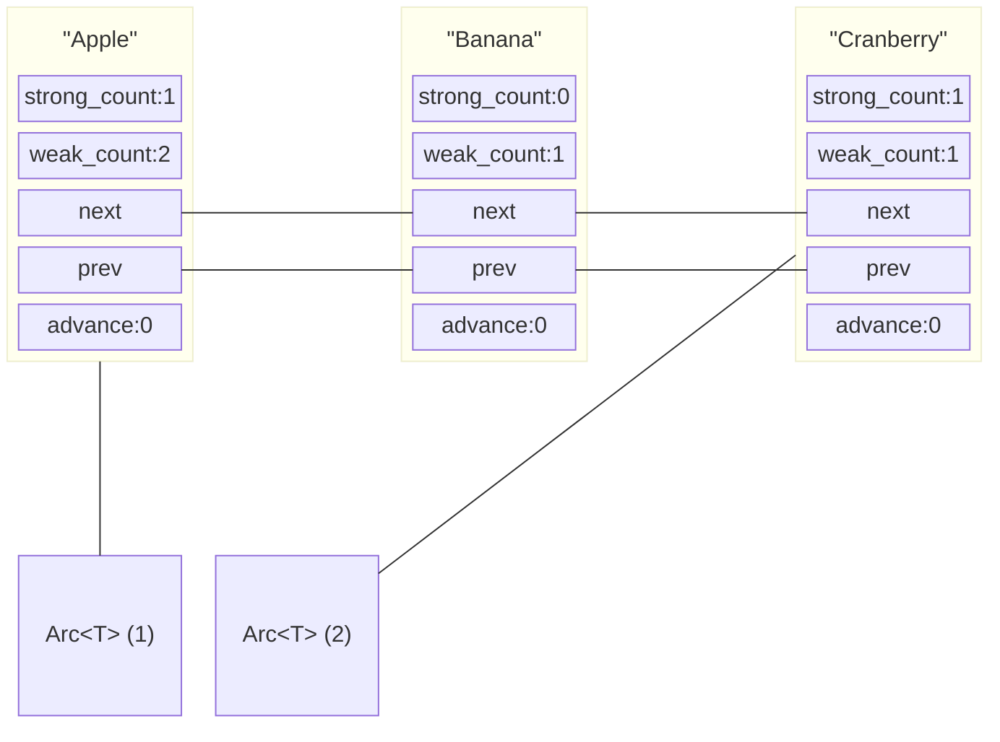
```mermaid
block-beta
  columns 5
  block:I
    columns 1
    uct("<div style="display:flex; justify-content: flex-start; align-items:flex-end;">&quot;Apple&quot</div>"):1
    columns 1
    strong_count["strong_count:1"]
    weak_count["weak_count:2"]
    next
    prev
    advance["advance:0"]
  end
  space
  block:I2
    columns 1
    uct2("<div style="display:flex; justify-content: flex-start; align-items:flex-end;">&quot;Banana&quot;</div>"):1
    columns 1
    strong_count2["strong_count:0"]
    weak_count2["weak_count:1"]
    next2["next"]
    prev2["prev"]
    advance2["advance:0"]
  end
  space
  block:I3
    columns 1
    uct3("<div style="display:flex; justify-content: flex-start; align-items:flex-end;">&quot;Cranberry&quot;</div>"):1
    columns 1
    strong_count3["strong_count:1"]
    weak_count3["weak_count:1"]
    next3["next"]
    prev3["prev"]
    advance3["advance:0"]
  end
  block:J 
    columns 1
    space
    D["Arc&lt;T&gt; (1)"]
  end
  block:J2
    columns 1
    space
    D2["Arc&lt;T&gt; (2)"]
  end
  D --- I
  D2 --- I3
  next --- next2
  next2 --- next3
  prev2 --- prev
  prev3 --- prev2
class uct,uct2,uct3,J,J2 BT
classDef BT stroke:transparent,fill:transparent

```


---

^
We're instance (1), and we want to fetch the new value that's available.
Increment 'advance' 1
this protects 'Banana' node from being deallocated
 
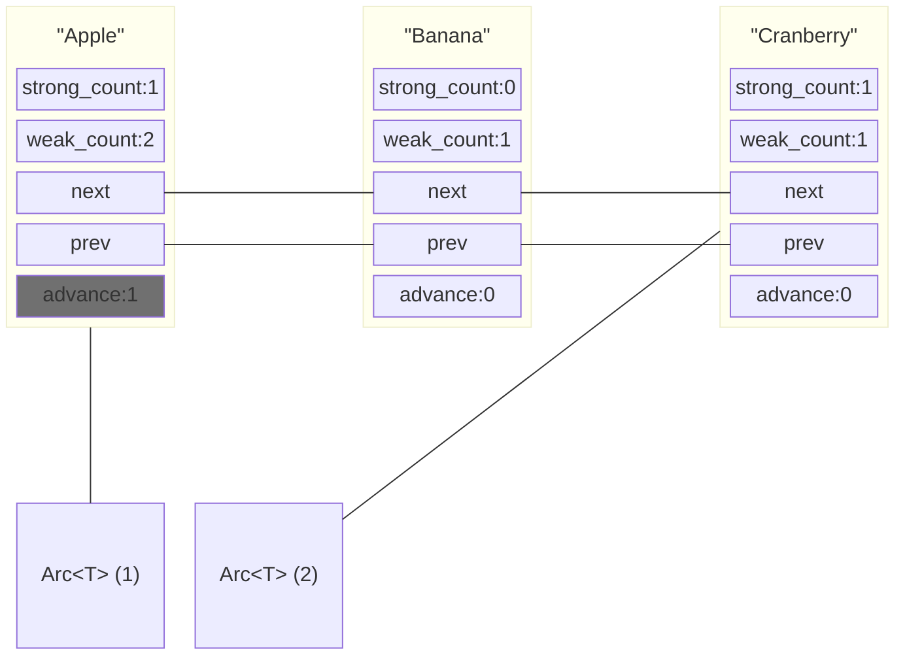
```mermaid
block-beta
  columns 5
  block:I
    columns 1
    uct("<div style="display:flex; justify-content: flex-start; align-items:flex-end;">&quot;Apple&quot</div>"):1
    columns 1
    strong_count["strong_count:1"]
    weak_count["weak_count:2"]
    next
    prev
    advance["advance:1"]
  end
  space
  block:I2
    columns 1
    uct2("<div style="display:flex; justify-content: flex-start; align-items:flex-end;">&quot;Banana&quot;</div>"):1
    columns 1
    strong_count2["strong_count:0"]
    weak_count2["weak_count:1"]
    next2["next"]
    prev2["prev"]
    advance2["advance:0"]
  end
  space
  block:I3
    columns 1
    uct3("<div style="display:flex; justify-content: flex-start; align-items:flex-end;">&quot;Cranberry&quot;</div>"):1
    columns 1
    strong_count3["strong_count:1"]
    weak_count3["weak_count:1"]
    next3["next"]
    prev3["prev"]
    advance3["advance:0"]
  end
  block:J 
    columns 1
    space
    D["Arc&lt;T&gt; (1)"]
  end
  block:J2
    columns 1
    space
    D2["Arc&lt;T&gt; (2)"]
  end
  space
  D --- I
  D2 --- I3
  next --- next2
  next2 --- next3
  prev2 --- prev
  prev3 --- prev2
class uct,uct2,uct3,J,J2 BT
classDef BT stroke:transparent,fill:transparent
class advance A
classDef A fill:#707070

```


---

^
Increment 'weak' 
This grants us shared ownership over Banana


```mermaid
block-beta
  columns 5
  block:I
    columns 1
    uct("<div style="display:flex; justify-content: flex-start; align-items:flex-end;">&quot;Apple&quot</div>"):1
    columns 1
    strong_count["strong_count:1"]
    weak_count["weak_count:2"]
    next
    prev
    advance["advance:1"]
  end
  space
  block:I2
    columns 1
    uct2("<div style="display:flex; justify-content: flex-start; align-items:flex-end;">&quot;Banana&quot;</div>"):1
    columns 1
    strong_count2["strong_count:0"]
    weak_count2["weak_count:2"]
    next2["next"]
    prev2["prev"]
    advance2["advance:0"]
  end
  space
  block:I3
    columns 1
    uct3("<div style="display:flex; justify-content: flex-start; align-items:flex-end;">&quot;Cranberry&quot;</div>"):1
    columns 1
    strong_count3["strong_count:1"]
    weak_count3["weak_count:1"]
    next3["next"]
    prev3["prev"]
    advance3["advance:0"]
  end
  block:J 
    columns 1
    space
    D["Arc&lt;T&gt; (1)"]
  end
  block:J2
    columns 1
    space
    D2["Arc&lt;T&gt; (2)"]
  end
  space
  D --- I
  D2 --- I3
  next --- next2
  next2 --- next3
  prev2 --- prev
  prev3 --- prev2
class uct,uct2,uct3,J,J2 BT
classDef BT stroke:transparent,fill:transparent
class weak_count2 A
classDef A fill:#707070

```


---

^
Decrement 'advance' 1
We don't need protection of 'advance' since we now have a weak ref.


```mermaid
block-beta
  columns 5
  block:I
    columns 1
    uct("<div style="display:flex; justify-content: flex-start; align-items:flex-end;">&quot;Apple&quot</div>"):1
    columns 1
    strong_count["strong_count:1"]
    weak_count["weak_count:2"]
    next
    prev
    advance["advance:0"]
  end
  space
  block:I2
    columns 1
    uct2("<div style="display:flex; justify-content: flex-start; align-items:flex-end;">&quot;Banana&quot;</div>"):1
    columns 1
    strong_count2["strong_count:0"]
    weak_count2["weak_count:2"]
    next2["next"]
    prev2["prev"]
    advance2["advance:0"]
  end
  space
  block:I3
    columns 1
    uct3("<div style="display:flex; justify-content: flex-start; align-items:flex-end;">&quot;Cranberry&quot;</div>"):1
    columns 1
    strong_count3["strong_count:1"]
    weak_count3["weak_count:1"]
    next3["next"]
    prev3["prev"]
    advance3["advance:0"]
  end
  block:J 
    columns 1
    space
    D["Arc&lt;T&gt; (1)"]
  end
  block:J2
    columns 1
    space
    D2["Arc&lt;T&gt; (2)"]
  end
  space
  D --- I
  D2 --- I3
  next --- next2
  next2 --- next3
  prev2 --- prev
  prev3 --- prev2
class uct,uct2,uct3,J,J2 BT
classDef BT stroke:transparent,fill:transparent
class advance A
classDef A fill:#707070

```


---

^
Increment 'Advance'


```mermaid
block-beta
  columns 5
  block:I
    columns 1
    uct("<div style="display:flex; justify-content: flex-start; align-items:flex-end;">&quot;Apple&quot</div>"):1
    columns 1
    strong_count["strong_count:1"]
    weak_count["weak_count:2"]
    next
    prev
    advance["advance:0"]
  end
  space
  block:I2
    columns 1
    uct2("<div style="display:flex; justify-content: flex-start; align-items:flex-end;">&quot;Banana&quot;</div>"):1
    columns 1
    strong_count2["strong_count:0"]
    weak_count2["weak_count:2"]
    next2["next"]
    prev2["prev"]
    advance2["advance:1"]
  end
  space
  block:I3
    columns 1
    uct3("<div style="display:flex; justify-content: flex-start; align-items:flex-end;">&quot;Cranberry&quot;</div>"):1
    columns 1
    strong_count3["strong_count:1"]
    weak_count3["weak_count:1"]
    next3["next"]
    prev3["prev"]
    advance3["advance:0"]
  end
  block:J 
    columns 1
    space
    D["Arc&lt;T&gt; (1)"]
  end
  block:J2
    columns 1
    space
    D2["Arc&lt;T&gt; (2)"]
  end
  space
  D --- I
  D2 --- I3
  next --- next2
  next2 --- next3
  prev2 --- prev
  prev3 --- prev2
class uct,uct2,uct3,J,J2 BT
classDef BT stroke:transparent,fill:transparent
class advance2 A
classDef A fill:#707070

```


---

^
Increment 'Weak'

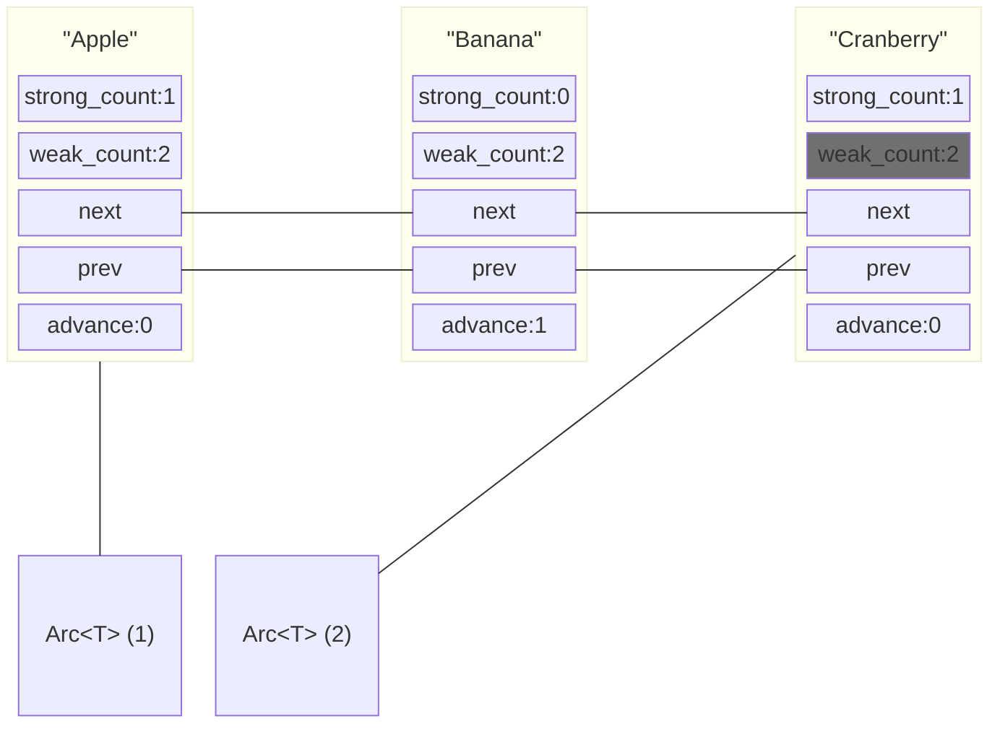
```mermaid
block-beta
  columns 5
  block:I
    columns 1
    uct("<div style="display:flex; justify-content: flex-start; align-items:flex-end;">&quot;Apple&quot</div>"):1
    columns 1
    strong_count["strong_count:1"]
    weak_count["weak_count:2"]
    next
    prev
    advance["advance:0"]
  end
  space
  block:I2
    columns 1
    uct2("<div style="display:flex; justify-content: flex-start; align-items:flex-end;">&quot;Banana&quot;</div>"):1
    columns 1
    strong_count2["strong_count:0"]
    weak_count2["weak_count:2"]
    next2["next"]
    prev2["prev"]
    advance2["advance:1"]
  end
  space
  block:I3
    columns 1
    uct3("<div style="display:flex; justify-content: flex-start; align-items:flex-end;">&quot;Cranberry&quot;</div>"):1
    columns 1
    strong_count3["strong_count:1"]
    weak_count3["weak_count:2"]
    next3["next"]
    prev3["prev"]
    advance3["advance:0"]
  end
  block:J 
    columns 1
    space
    D["Arc&lt;T&gt; (1)"]
  end
  block:J2
    columns 1
    space
    D2["Arc&lt;T&gt; (2)"]
  end
  space
  D --- I
  D2 --- I3
  next --- next2
  next2 --- next3
  prev2 --- prev
  prev3 --- prev2
class uct,uct2,uct3,J,J2 BT
classDef BT stroke:transparent,fill:transparent
class weak_count3 A
classDef A fill:#707070

```

---

^
Decrement 'Advance'

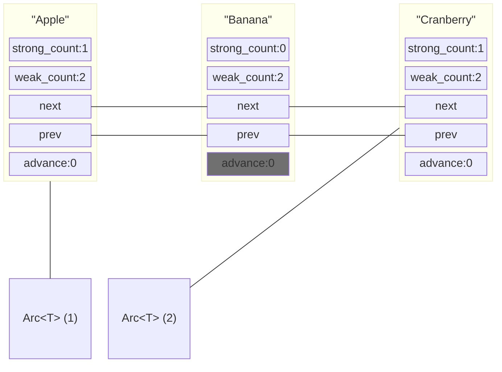
```mermaid
block-beta
  columns 5
  block:I
    columns 1
    uct("<div style="display:flex; justify-content: flex-start; align-items:flex-end;">&quot;Apple&quot</div>"):1
    columns 1
    strong_count["strong_count:1"]
    weak_count["weak_count:2"]
    next
    prev
    advance["advance:0"]
  end
  space
  block:I2
    columns 1
    uct2("<div style="display:flex; justify-content: flex-start; align-items:flex-end;">&quot;Banana&quot;</div>"):1
    columns 1
    strong_count2["strong_count:0"]
    weak_count2["weak_count:2"]
    next2["next"]
    prev2["prev"]
    advance2["advance:0"]
  end
  space
  block:I3
    columns 1
    uct3("<div style="display:flex; justify-content: flex-start; align-items:flex-end;">&quot;Cranberry&quot;</div>"):1
    columns 1
    strong_count3["strong_count:1"]
    weak_count3["weak_count:2"]
    next3["next"]
    prev3["prev"]
    advance3["advance:0"]
  end
  block:J 
    columns 1
    space
    D["Arc&lt;T&gt; (1)"]
  end
  block:J2
    columns 1
    space
    D2["Arc&lt;T&gt; (2)"]
  end
  space
  D --- I
  D2 --- I3
  next --- next2
  next2 --- next3
  prev2 --- prev
  prev3 --- prev2
class uct,uct2,uct3,J,J2 BT
classDef BT stroke:transparent,fill:transparent
class advance2 A
classDef A fill:#707070

```


---

^
Decrement 'Weak'

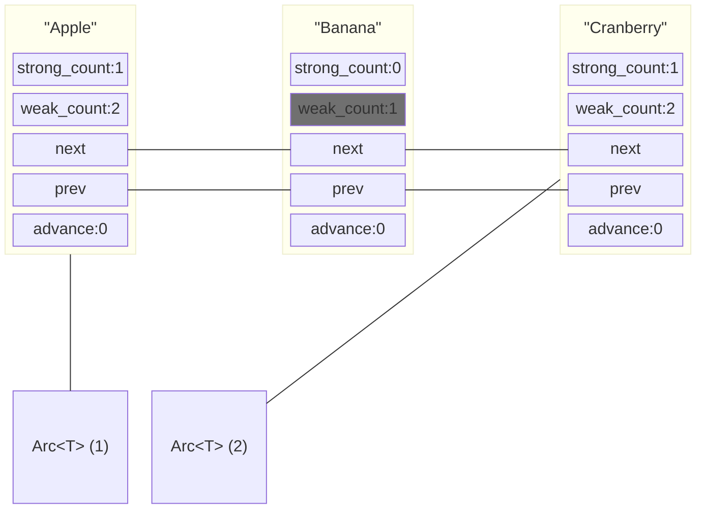
```mermaid
block-beta
  columns 5
  block:I
    columns 1
    uct("<div style="display:flex; justify-content: flex-start; align-items:flex-end;">&quot;Apple&quot</div>"):1
    columns 1
    strong_count["strong_count:1"]
    weak_count["weak_count:2"]
    next
    prev
    advance["advance:0"]
  end
  space
  block:I2
    columns 1
    uct2("<div style="display:flex; justify-content: flex-start; align-items:flex-end;">&quot;Banana&quot;</div>"):1
    columns 1
    strong_count2["strong_count:0"]
    weak_count2["weak_count:1"]
    next2["next"]
    prev2["prev"]
    advance2["advance:0"]
  end
  space
  block:I3
    columns 1
    uct3("<div style="display:flex; justify-content: flex-start; align-items:flex-end;">&quot;Cranberry&quot;</div>"):1
    columns 1
    strong_count3["strong_count:1"]
    weak_count3["weak_count:2"]
    next3["next"]
    prev3["prev"]
    advance3["advance:0"]
  end
  block:J 
    columns 1
    space
    D["Arc&lt;T&gt; (1)"]
  end
  block:J2
    columns 1
    space
    D2["Arc&lt;T&gt; (2)"]
  end
  space
  D --- I
  D2 --- I3
  next --- next2
  next2 --- next3
  prev2 --- prev
  prev3 --- prev2
class uct,uct2,uct3,J,J2 BT
classDef BT stroke:transparent,fill:transparent
class weak_count2 A
classDef A fill:#707070

```


---

^
increment destination strong count 

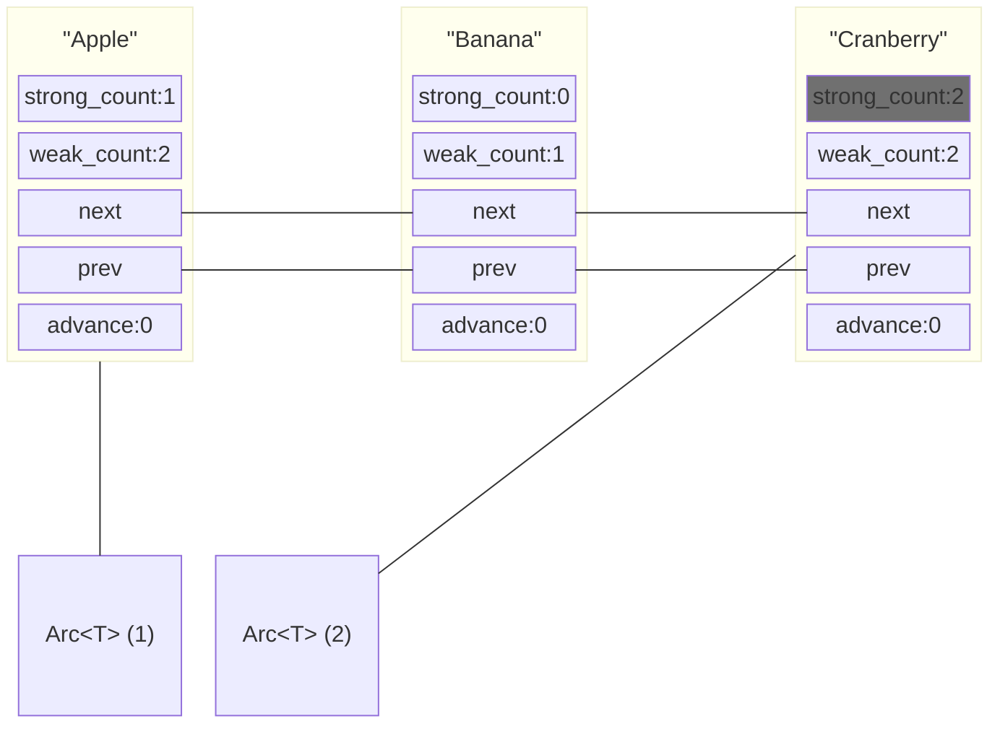
```mermaid
block-beta
  columns 5
  block:I
    columns 1
    uct("<div style="display:flex; justify-content: flex-start; align-items:flex-end;">&quot;Apple&quot</div>"):1
    columns 1
    strong_count["strong_count:1"]
    weak_count["weak_count:2"]
    next
    prev
    advance["advance:0"]
  end
  space
  block:I2
    columns 1
    uct2("<div style="display:flex; justify-content: flex-start; align-items:flex-end;">&quot;Banana&quot;</div>"):1
    columns 1
    strong_count2["strong_count:0"]
    weak_count2["weak_count:1"]
    next2["next"]
    prev2["prev"]
    advance2["advance:0"]
  end
  space
  block:I3
    columns 1
    uct3("<div style="display:flex; justify-content: flex-start; align-items:flex-end;">&quot;Cranberry&quot;</div>"):1
    columns 1
    strong_count3["strong_count:2"]
    weak_count3["weak_count:2"]
    next3["next"]
    prev3["prev"]
    advance3["advance:0"]
  end
  block:J 
    columns 1
    space
    D["Arc&lt;T&gt; (1)"]
  end
  block:J2
    columns 1
    space
    D2["Arc&lt;T&gt; (2)"]
  end
  space
  D --- I
  D2 --- I3
  next --- next2
  next2 --- next3
  prev2 --- prev
  prev3 --- prev2
class uct,uct2,uct3,J,J2 BT
classDef BT stroke:transparent,fill:transparent
class strong_count3 A
classDef A fill:#707070

```


---

^
decrement destination weak count 


```mermaid
block-beta
  columns 5
  block:I
    columns 1
    uct("<div style="display:flex; justify-content: flex-start; align-items:flex-end;">&quot;Apple&quot</div>"):1
    columns 1
    strong_count["strong_count:1"]
    weak_count["weak_count:2"]
    next
    prev
    advance["advance:0"]
  end
  space
  block:I2
    columns 1
    uct2("<div style="display:flex; justify-content: flex-start; align-items:flex-end;">&quot;Banana&quot;</div>"):1
    columns 1
    strong_count2["strong_count:0"]
    weak_count2["weak_count:1"]
    next2["next"]
    prev2["prev"]
    advance2["advance:0"]
  end
  space
  block:I3
    columns 1
    uct3("<div style="display:flex; justify-content: flex-start; align-items:flex-end;">&quot;Cranberry&quot;</div>"):1
    columns 1
    strong_count3["strong_count:2"]
    weak_count3["weak_count:1"]
    next3["next"]
    prev3["prev"]
    advance3["advance:0"]
  end
  block:J 
    columns 1
    space
    D["Arc&lt;T&gt; (1)"]
  end
  block:J2
    columns 1
    space
    D2["Arc&lt;T&gt; (2)"]
  end
  space
  D --- I
  D2 --- I3
  next --- next2
  next2 --- next3
  prev2 --- prev
  prev3 --- prev2
class uct,uct2,uct3,J,J2 BT
classDef BT stroke:transparent,fill:transparent
class weak_count3 A
classDef A fill:#707070

```

---

^
Decrement orig strong

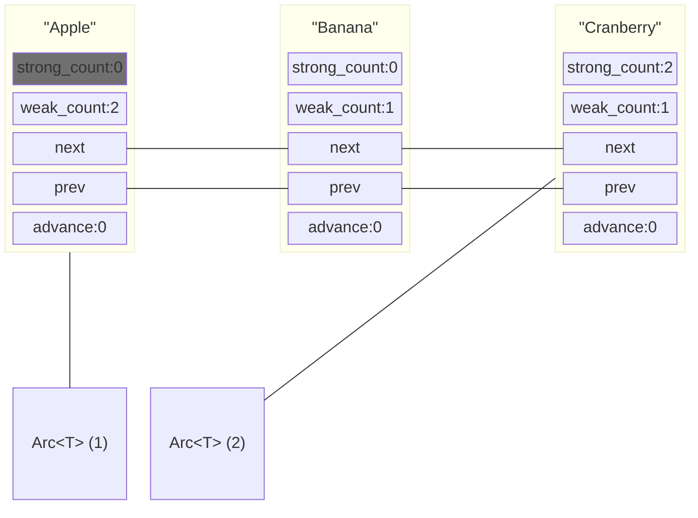
```mermaid
block-beta
  columns 5
  block:I
    columns 1
    uct("<div style="display:flex; justify-content: flex-start; align-items:flex-end;">&quot;Apple&quot</div>"):1
    columns 1
    strong_count["strong_count:0"]
    weak_count["weak_count:2"]
    next
    prev
    advance["advance:0"]
  end
  space
  block:I2
    columns 1
    uct2("<div style="display:flex; justify-content: flex-start; align-items:flex-end;">&quot;Banana&quot;</div>"):1
    columns 1
    strong_count2["strong_count:0"]
    weak_count2["weak_count:1"]
    next2["next"]
    prev2["prev"]
    advance2["advance:0"]
  end
  space
  block:I3
    columns 1
    uct3("<div style="display:flex; justify-content: flex-start; align-items:flex-end;">&quot;Cranberry&quot;</div>"):1
    columns 1
    strong_count3["strong_count:2"]
    weak_count3["weak_count:1"]
    next3["next"]
    prev3["prev"]
    advance3["advance:0"]
  end
  block:J 
    columns 1
    space
    D["Arc&lt;T&gt; (1)"]
  end
  block:J2
    columns 1
    space
    D2["Arc&lt;T&gt; (2)"]
  end
  space
  D --- I
  D2 --- I3
  next --- next2
  next2 --- next3
  prev2 --- prev
  prev3 --- prev2
class uct,uct2,uct3,J,J2 BT
classDef BT stroke:transparent,fill:transparent
class strong_count A
classDef A fill:#707070

```


---

^
Decrement orig weak

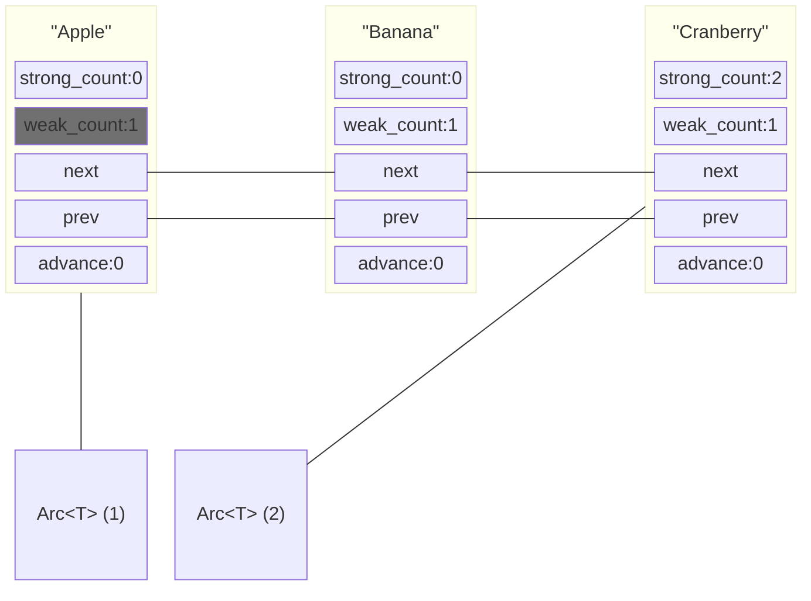
```mermaid
block-beta
  columns 5
  block:I
    columns 1
    uct("<div style="display:flex; justify-content: flex-start; align-items:flex-end;">&quot;Apple&quot</div>"):1
    columns 1
    strong_count["strong_count:0"]
    weak_count["weak_count:1"]
    next
    prev
    advance["advance:0"]
  end
  space
  block:I2
    columns 1
    uct2("<div style="display:flex; justify-content: flex-start; align-items:flex-end;">&quot;Banana&quot;</div>"):1
    columns 1
    strong_count2["strong_count:0"]
    weak_count2["weak_count:1"]
    next2["next"]
    prev2["prev"]
    advance2["advance:0"]
  end
  space
  block:I3
    columns 1
    uct3("<div style="display:flex; justify-content: flex-start; align-items:flex-end;">&quot;Cranberry&quot;</div>"):1
    columns 1
    strong_count3["strong_count:2"]
    weak_count3["weak_count:1"]
    next3["next"]
    prev3["prev"]
    advance3["advance:0"]
  end
  block:J 
    columns 1
    space
    D["Arc&lt;T&gt; (1)"]
  end
  block:J2
    columns 1
    space
    D2["Arc&lt;T&gt; (2)"]
  end
  space
  D --- I
  D2 --- I3
  next --- next2
  next2 --- next3
  prev2 --- prev
  prev3 --- prev2
class uct,uct2,uct3,J,J2 BT
classDef BT stroke:transparent,fill:transparent
class weak_count A
classDef A fill:#707070

```

---

^
Finished! Update ArcShift-instance

```mermaid
block-beta
  columns 5
  block:I
    columns 1
    uct("<div style="display:flex; justify-content: flex-start; align-items:flex-end;">&quot;Apple&quot</div>"):1
    columns 1
    strong_count["strong_count:0"]
    weak_count["weak_count:1"]
    next
    prev
    advance["advance:0"]
  end
  space
  block:I2
    columns 1
    uct2("<div style="display:flex; justify-content: flex-start; align-items:flex-end;">&quot;Banana&quot;</div>"):1
    columns 1
    strong_count2["strong_count:0"]
    weak_count2["weak_count:1"]
    next2["next"]
    prev2["prev"]
    advance2["advance:0"]
  end
  space
  block:I3
    columns 1
    uct3("<div style="display:flex; justify-content: flex-start; align-items:flex-end;">&quot;Cranberry&quot;</div>"):1
    columns 1
    strong_count3["strong_count:2"]
    weak_count3["weak_count:1"]
    next3["next"]
    prev3["prev"]
    advance3["advance:0"]
  end
  block:J 
    columns 1
    space
    D["Arc&lt;T&gt; (1)"]
  end
  block:J2
    columns 1
    space
    D2["Arc&lt;T&gt; (2)"]
  end
  space
  D --- I3
  D2 --- I3
  next --- next2
  next2 --- next3
  prev2 --- prev
  prev3 --- prev2
class uct,uct2,uct3,J,J2 BT
classDef BT stroke:transparent,fill:transparent
class D A
classDef A fill:#707070

```


^
Now, we won't have time to look at the GC-algorithm in this talk. Please come and talk to me
after if you're interested to learn more!


---
^Benchmarks on Ryzen 7950X, in linux.
Similar results on Macos.
This is an optimistic case for RwLock, since there's no contention.
Note, these benchmarks are mostly for reads. If you have a write heavy use case, ArcShift might not be suitable.
TODO: Add contended bench, rwlock


[.text: #000000]
[.background-color: #FFFFFF]

[.column]


ArcShift read:

```
    let mut ac = ArcShift::new(42u32);
    c.bench_function("arcshift_get", |b| {
        b.iter(|| {
            *ac.get()
        })
    });
```

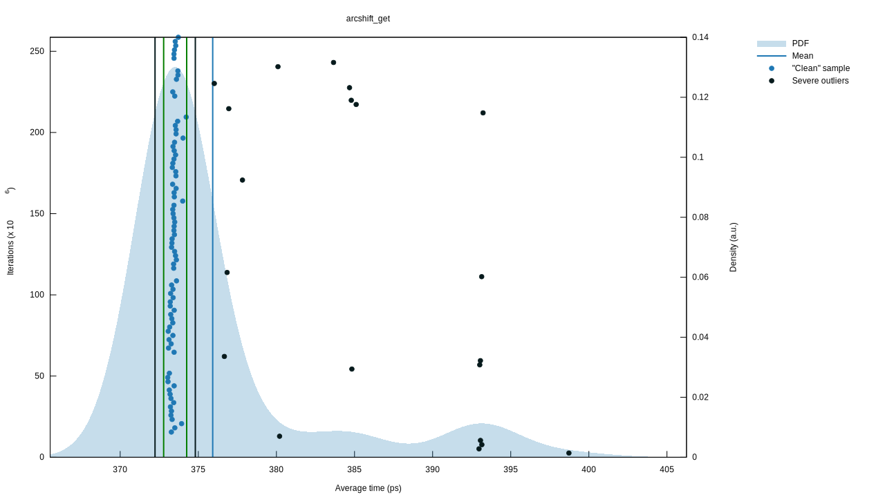

`approx 0.37 ns`


[.column]

RwLock read:

```
    let ac = RwLock::new(42u32);
    c.bench_function("rwlock_read", |b| {
        b.iter(|| {
            let guard = ac.read().unwrap();
            *guard
        })
    });
```


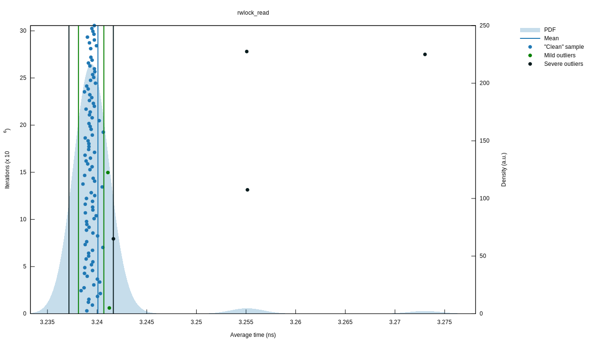

`approx 3.2 ns`

---

^Same, but under contention. You can see that in this micro-benchmark, ArcShift is 100 times faster.


[.autoscale: true]
[.text: #000000]
[.background-color: #FFFFFF]

[.column]

ArcShift read (contended):

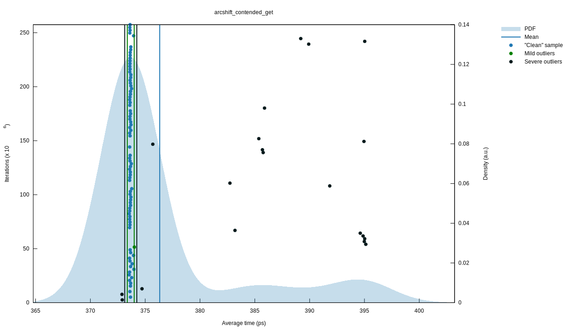

`approx 0.37 ns`

[.column]

RwLock read (contended):

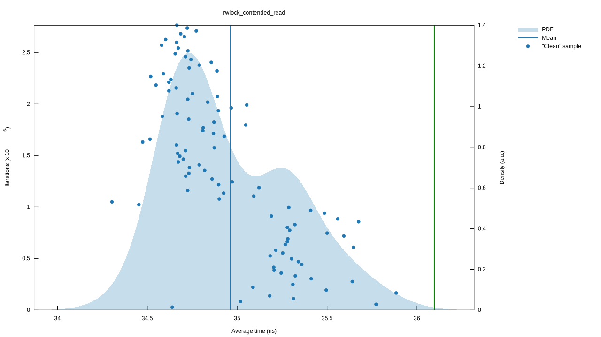

`approx 35 ns`

---

[.autoscale: true]
[.text: #000000]
[.background-color: #FFFFFF]

[.column]

ArcShift update:

```
    let mut ac = ArcShift::new(42u32);
    c.bench_function("arcshift_update", |b| {
        b.iter(|| {
            ac.update(43);
        })
    });
```

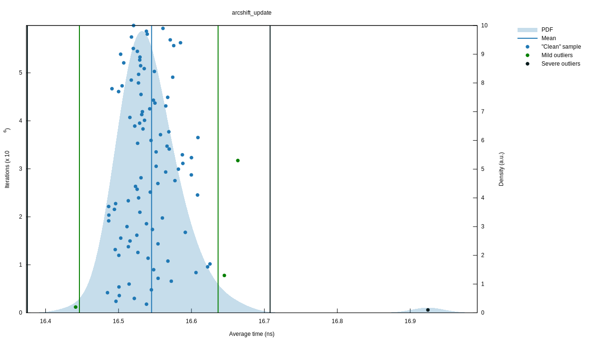

`approx 16.5 ns`

[.column]

RwLock write:

```
    let ac = RwLock::new(42u32);
    c.bench_function("rwlock_write", |b| {
        b.iter(|| {
            let mut guard = ac.write().unwrap();
            *guard = 43;
        })
    });
```

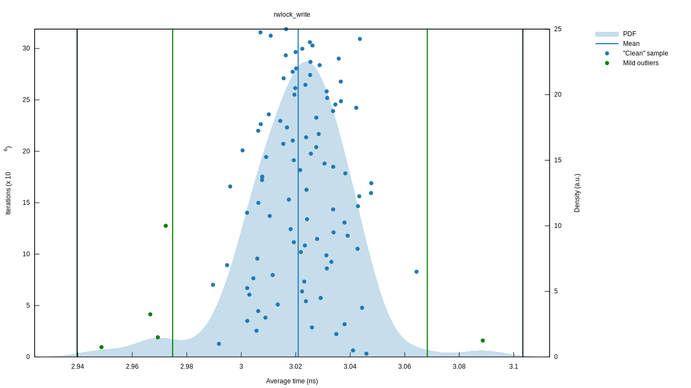

`approx 3.0 ns`

---
[.graph: #00ff00, #aaff00, #000000]

^
Your mileage may vary. Terms and conditions apply!
Here's a comparison of the operations 'get' and 'update'
using ArcShift and RwLock. 
As you can see, ArcShift is faster for reads,
while slower for writes.


Benchmark results.

```mermaid
%%{init: { "themeVariables": {"xyChart": {"plotColorPalette": "#404040"} } }}%%
     
xychart-beta
    title "Read latency (lower = better)"
    x-axis ["Arc", "RwLock", "ArcShift", "RwLock Contd.", "ArcShift Contd."]
    y-axis "Time, ns" 0 --> 35
    bar [0.183, 3.252, 0.375,34.760,0.376]    
```

---
[.graph: #00ff00, #aaff00, #000000]

Benchmark results.

```mermaid
%%{init: { "themeVariables": {"xyChart": {"plotColorPalette": "#404040"} } }}%%
     
xychart-beta
    title "Write latency (lower = better)"
    x-axis ["RwLock Write", "ArcShift Update"]
    y-axis "Time, ns" 0 --> 35
    bar [3.02, 16.45]    
```

---


## Lock-free vs wait-free

^
NEXT
An algorithm if lock free if it always makes global progress.
I.e, if one thread has to retry or wait, then it's guaranteed that this is *because* some other thread must have made progress.
Also, if one thread stops executing, no matter where in the flow it is, this does not block any other thread.
NEXT
In a wait-free algorithm every operation finishes in a bounded number of steps.
    
- An algorithm is lock-free if it always makes global progress.
- An algorithm is wait-free if each operation finishes in a bounded number of steps

---

# Assuring correctness

^
Lock free algorithms are notoriously hard to get right.

* Lock free algorithms are notoriously hard to get right
* Exercising racing code paths is hard
* Number of possible schedulings grows exponentially with algorithm complexity

---
^This is a part of the update-logic of ArcShift.

```rust
loop {
    let cur_next = item.next.load(Ordering::Relaxed);
    ...
    match item.next.compare_exchange(
        cur_next,
        new_next,
        Ordering::SeqCst,
        Ordering::Relaxed,
    ) {
        Ok(_) => {
            ...
            return;
        }
        Err(_) => {
            ...
            continue;
        }
    }
} 
```

---

# Testing Tools

^
Loom is a framework that can exhaustively test all possible interleavings
of multiple threads, and is super powerful.
Shuttle is basically a faster loom, that isn't as precise.
Miri is super detailed, super slow, and has fantastic error messages, but doesn't explore
as many interleavings.

* Loom
* Shuttle
* Miri
* Cargo mutants


---
# Exhaustive tests
^
We also run tests that run all combinations of primitive operations on 3 threads.

```
    let ops = vec![
        |arcshift| arcshift.update(owner.create()),
        |arcshift| arcshift.get(),
        |arcshift| arcshift.shared_get(),
        |arcshift| drop(arcshift),    
    ];
    for op1 in ops.iter() {
        for op2 in ops.iter() {
            for op3 in ops.iter() {
                run_3_threads(op1, op2, op3);
            }
        }
    }
```

---


# Other testing techniques

^
NEXT
We have a method that traverses all pointers, and checks that all pointers are valid
(by using canaries), and that all counts are correct.
NEXT
We also use a special type that allows creating dummy objects, and tracking if they are deleted.
This way we can detect memory leaks even when not running under miri.
 
* State-validation
* Memory-leak tracking dummy payload
* Panicking drop
* 10MB large values
* Recursive structures (with weak back-pointers)
* Sending ArcShift instances to other threads

---

## ArcShift - In Conclusion

* Alternative to Arc<RwLock<T>> [^1]
* Very fast for read-heavy loads
* Lock-free
* No dependencies
* Can be used with no_std + alloc (no thread locals)
* Available on crates.io as 'arcshift'

[^1]: When modifcation in-place not required.

---

### Start of bonus material

---

# Random tests

* Generate random operations
* Distribute them randomly across multiple threads
* Determine plausible end-states


---

# Other fun challenges
* C++ memory ordering
* Variance
* Send + Sync
* 'unsafe { }'
* Handling unsized objects
* nostd-support

---

# Invariants

^ First step is to establish a set of variants
Then it must be verified for every single line of code, that it is only
relying on actual guaranteed invariants.

- strong count > 0 means payload must not be dropped
- weak count > 0 means node must not be deallocated
- all strong counts collectively own a weak count
- prev-pointers own a weak count on previous node
- next-pointers must point to some more recent node
- deallocated nodes must not be accessed

---

# Memory ordering

^
Rust uses the C++ memory order. This means that the program can show bizarre behavior.
NEXT
ArcShift model assumed sequential consistency
NEXT
Loom doesn't fully support this, and has both false positives and false negatives. This means we have to
insert some full sequentially consistent fences (which loom does support), for ArcShift to work with loom.
NEXT
Shuttle only supports sequential consistency
NEXT
Because of this, ArcShift prioritized verifiable correctness and uses SeqCst ordering even in some places
it's not technically necessary, in order to make it more verifiable.

* ArcShift model needs sequential consistency
* Loom doesn't support this fully
* Shuttle only supports sequential consistency
* ArcShift is conservative and specifies sequential consistency except for hot paths.

---


| Stat              | Value | 
|-------------------|-------|
| Lines of impl     | ~2000 | 
| Total lines       | 5643  | 
| Lines of comments | 1215  | 
| Unsafe blocks     | 187   | 
| #SAFETY comments  | 187   | 
| Atomic ops:       | 59    |

---
### A fun bug

What's wrong with this definition?
```rust
pub struct ArcShift<T: ?Sized> {
    item: NonNull<ItemHolderDummy<T>>,
}
```


---
### A fun bug

^ Without the phantom data below, ArcShift becomes covariant over T.
This means you can use an ArcShift<&'static T> with a function with a signature with a shorter lifetime.
Then you could update the value of the ArcShift with a short-lived value. But the caller could then return this
supposedly 'static' ArcShift, and use it after the updated value is dropped.

It needs to be:
```rust
pub struct ArcShift<T: ?Sized> {
    item: NonNull<ItemHolderDummy<T>>,
    pd: PhantomData<*mut T>
}
```

Otherwise Arc<&'static T> is a subtype of any Arc<&T>.


---

^start pos


```mermaid
block-beta
  columns 5
  block:I
    columns 1
    uct("<div style="display:flex; justify-content: flex-start; align-items:flex-end;">&quot;Apple&quot</div>"):1
    columns 1
    strong_count["strong_count:1"]
    weak_count["weak_count:2"]
    next["next"]
    prev["prev"]
    advance["advance:0"]
  end
  space
  block:I2
    columns 1
    uct2("<div style="display:flex; justify-content: flex-start; align-items:flex-end;">&quot;Banana&quot;</div>"):1
    columns 1
    strong_count2["strong_count:0"]
    weak_count2["weak_count:1"]
    next2["next"]
    prev2["prev"]
    advance2["advance:0"]
  end
  space
  block:I3
    columns 1
    uct3("<div style="display:flex; justify-content: flex-start; align-items:flex-end;">&quot;Cranberry&quot;</div>"):1
    columns 1
    strong_count3["strong_count:1"]
    weak_count3["weak_count:1"]
    next3["next"]
    prev3["prev"]
    advance3["advance:0"]
  end
  block:J 
    columns 1
    space
    D["Arc&lt;T&gt; (1)"]
  end
  block:J2
    columns 1
    space
    D2["Arc&lt;T&gt; (2)"]
  end
  space
  D --- I
  D2 --- I3
  next --- next2
  next2 --- next3
  prev2 --- prev
  prev3 --- prev2
class uct,uct2,uct3,J,J2 BT
classDef BT stroke:transparent,fill:transparent

```
---

^mark gc


```mermaid
block-beta
  columns 5
  block:I
    columns 1
    uct("<div style="display:flex; justify-content: flex-start; align-items:flex-end;">&quot;Apple&quot</div>"):1
    columns 1
    strong_count["strong_count:1"]
    weak_count["weak_count:2"]
    next["next"]
    prev["prev"]
    advance["advance:0"]
  end
  space
  block:I2
    columns 1
    uct2("<div style="display:flex; justify-content: flex-start; align-items:flex-end;">&quot;Banana&quot;</div>"):1
    columns 1
    strong_count2["strong_count:0"]
    weak_count2["weak_count:1"]
    next2["next"]
    prev2["prev"]
    advance2["advance:0"]
  end
  space
  block:I3
    columns 1
    uct3("<div style="display:flex; justify-content: flex-start; align-items:flex-end;">&quot;Cranberry&quot;</div>"):1
    columns 1
    strong_count3["strong_count:1"]
    weak_count3["weak_count:1"]
    next3["next:GC"]
    prev3["prev"]
    advance3["advance:0"]
  end
  block:J 
    columns 1
    space
    D["Arc&lt;T&gt; (1)"]
  end
  block:J2
    columns 1
    space
    D2["Arc&lt;T&gt; (2)"]
  end
  space
  D --- I
  D2 --- I3
  next --- next2
  next2 --- next3
  prev2 --- prev
  prev3 --- prev2
class uct,uct2,uct3,J,J2 BT
classDef BT stroke:transparent,fill:transparent
class next3 A
classDef A fill:#707070

```
---

^
Back to the GC algorithm.
We continue marking nodes with the 'GC' mark


```mermaid
block-beta
  columns 5
  block:I
    columns 1
    uct("<div style="display:flex; justify-content: flex-start; align-items:flex-end;">&quot;Apple&quot</div>"):1
    columns 1
    strong_count["strong_count:1"]
    weak_count["weak_count:2"]
    next["next"]
    prev["prev"]
    advance["advance:0"]
  end
  space
  block:I2
    columns 1
    uct2("<div style="display:flex; justify-content: flex-start; align-items:flex-end;">&quot;Banana&quot;</div>"):1
    columns 1
    strong_count2["strong_count:0"]
    weak_count2["weak_count:1"]
    next2["next:GC"]
    prev2["prev"]
    advance2["advance:0"]
  end
  space
  block:I3
    columns 1
    uct3("<div style="display:flex; justify-content: flex-start; align-items:flex-end;">&quot;Cranberry&quot;</div>"):1
    columns 1
    strong_count3["strong_count:1"]
    weak_count3["weak_count:1"]
    next3["next:GC"]
    prev3["prev"]
    advance3["advance:0"]
  end
  block:J 
    columns 1
    space
    D["Arc&lt;T&gt; (1)"]
  end
  block:J2
    columns 1
    space
    D2["Arc&lt;T&gt; (2)"]
  end
  space
  D --- I
  D2 --- I3
  next --- next2
  next2 --- next3
  prev2 --- prev
  prev3 --- prev2
class uct,uct2,uct3,J,J2 BT
classDef BT stroke:transparent,fill:transparent
class next2 A
classDef A fill:#707070

```

---

^
Now we marked all nodes with GC
No other GC process can race with us now
However, we could race with an 'advance'.
Let's see how this works.

```mermaid
block-beta
  columns 5
  block:I
    columns 1
    uct("<div style="display:flex; justify-content: flex-start; align-items:flex-end;">&quot;Apple&quot</div>"):1
    columns 1
    strong_count["strong_count:1"]
    weak_count["weak_count:2"]
    next["next:GC"]
    prev["prev"]
    advance["advance:0"]
  end
  space
  block:I2
    columns 1
    uct2("<div style="display:flex; justify-content: flex-start; align-items:flex-end;">&quot;Banana&quot;</div>"):1
    columns 1
    strong_count2["strong_count:0"]
    weak_count2["weak_count:1"]
    next2["next:GC"]
    prev2["prev"]
    advance2["advance:0"]
  end
  space
  block:I3
    columns 1
    uct3("<div style="display:flex; justify-content: flex-start; align-items:flex-end;">&quot;Cranberry&quot;</div>"):1
    columns 1
    strong_count3["strong_count:1"]
    weak_count3["weak_count:1"]
    next3["next:GC"]
    prev3["prev"]
    advance3["advance:0"]
  end
  block:J 
    columns 1
    space
    D["Arc&lt;T&gt; (1)"]
  end
  block:J2
    columns 1
    space
    D2["Arc&lt;T&gt; (2)"]
  end
  space
  D --- I
  D2 --- I3
  next --- next2
  next2 --- next3
  prev2 --- prev
  prev3 --- prev2
class uct,uct2,uct3,J,J2 BT
classDef BT stroke:transparent,fill:transparent
class next A
classDef A fill:#707070

```
---

^
Iterate through and put all next-pointers to cranberry
The key point is to check the 'advance_count' just after setting the next-pointer
If advance is != 0, don't run the GC.

```mermaid
block-beta
  columns 5
  block:I
    columns 1
    uct("<div style="display:flex; justify-content: flex-start; align-items:flex-end;">&quot;Apple&quot</div>"):1
    strong_count["strong_count:1"]
    weak_count["weak_count:2"]
    next["next:GC"]
    prev["prev"]
    advance["advance:0"]
  end
  space
  block:I2
    columns 1
    uct2("<div style="display:flex; justify-content: flex-start; align-items:flex-end;">&quot;Banana&quot;</div>"):1
    strong_count2["strong_count:0"]
    weak_count2["weak_count:1"]
    next2["next:GC"]
    prev2["prev"]
    advance2["advance:0"]
  end
  space
  block:I3
    columns 1
    uct3("<div style="display:flex; justify-content: flex-start; align-items:flex-end;">&quot;Cranberry&quot;</div>"):1
    strong_count3["strong_count:1"]
    weak_count3["weak_count:1"]
    next3["next:GC"]
    prev3["prev"]
    advance3["advance:0"]
  end
  block:J 
    columns 1
    space
    D["Arc&lt;T&gt; (1)"]
  end
  block:J2
    columns 1
    space
    D2["Arc&lt;T&gt; (2)"]
  end
  space
  D --- I
  D2 --- I3
  next --- next3
  next2 --- next3
  prev2 --- prev
  prev3 --- prev2
class uct,uct2,uct3,J,J2 BT
classDef BT stroke:transparent,fill:transparent
class next A
classDef A fill:#707070

```
---


^Set prev-ptrs

```mermaid
block-beta
  columns 5
  block:I
    columns 1
    uct("<div style="display:flex; justify-content: flex-start; align-items:flex-end;">&quot;Apple&quot</div>"):1
    strong_count["strong_count:1"]
    weak_count["weak_count:2"]
    next["next:GC"]
    prev["prev"]
    advance["advance:0"]
  end
  space
  block:I2
    columns 1
    uct2("<div style="display:flex; justify-content: flex-start; align-items:flex-end;">&quot;Banana&quot;</div>"):1
    strong_count2["strong_count:0"]
    weak_count2["weak_count:1"]
    next2["next:GC"]
    prev2["prev"]
    advance2["advance:0"]
  end
  space
  block:I3
    columns 1
    uct3("<div style="display:flex; justify-content: flex-start; align-items:flex-end;">&quot;Cranberry&quot;</div>"):1
    strong_count3["strong_count:1"]
    weak_count3["weak_count:1"]
    next3["next:GC"]
    prev3["prev"]
    advance3["advance:0"]
  end
  block:J 
    columns 1
    space
    D["Arc&lt;T&gt; (1)"]
  end
  block:J2
    columns 1
    space
    D2["Arc&lt;T&gt; (2)"]
  end
  space
  D --- I
  D2 --- I3
  next --- next3
  next2 --- next3
  prev2 --- prev
  prev3 --- prev
class uct,uct2,uct3,J,J2 BT
classDef BT stroke:transparent,fill:transparent
class prev3 A
classDef A fill:#707070

```
---


^
Safely delete pointer to banana

```mermaid
block-beta
  columns 5
  block:I
    columns 1
    uct("<div style="display:flex; justify-content: flex-start; align-items:flex-end;">&quot;Apple&quot</div>"):1
    strong_count["strong_count:1"]
    weak_count["weak_count:2"]
    next["next:GC"]
    prev["prev"]
    advance["advance:0"]
  end
  space
  space
  space
  block:I3
    columns 1
    uct3("<div style="display:flex; justify-content: flex-start; align-items:flex-end;">&quot;Cranberry&quot;</div>"):1
    strong_count3["strong_count:1"]
    weak_count3["weak_count:1"]
    next3["next:GC"]
    prev3["prev"]
    advance3["advance:0"]
  end
  block:J 
    columns 1
    space
    D["Arc&lt;T&gt; (1)"]
  end
  block:J2
    columns 1
    space
    D2["Arc&lt;T&gt; (2)"]
  end
  space
  D --- I
  D2 --- I3
  next --- next3
  prev3 --- prev
class uct,uct2,uct3,J,J2 BT
classDef BT stroke:transparent,fill:transparent

```
---

^
Remove GC

```mermaid
block-beta
  columns 5
  block:I
    columns 1
    uct("<div style="display:flex; justify-content: flex-start; align-items:flex-end;">&quot;Apple&quot</div>"):1
    strong_count["strong_count:1"]
    weak_count["weak_count:2"]
    next["next:GC"]
    prev["prev"]
    advance["advance:0"]
  end
  space
  space
  space
  block:I3
    columns 1
    uct3("<div style="display:flex; justify-content: flex-start; align-items:flex-end;">&quot;Cranberry&quot;</div>"):1
    strong_count3["strong_count:1"]
    weak_count3["weak_count:1"]
    next3["next"]
    prev3["prev"]
    advance3["advance:0"]
  end
  block:J 
    columns 1
    space
    D["Arc&lt;T&gt; (1)"]
  end
  block:J2
    columns 1
    space
    D2["Arc&lt;T&gt; (2)"]
  end
  space
  D --- I
  D2 --- I3
  next --- next3
  prev3 --- prev
class uct,uct2,uct3,J,J2 BT
classDef BT stroke:transparent,fill:transparent
class next3 A
classDef A fill:#707070

```
---

^
Remove GC

```mermaid
block-beta
  columns 5
  block:I
    columns 1
    uct("<div style="display:flex; justify-content: flex-start; align-items:flex-end;">&quot;Apple&quot</div>"):1
    strong_count["strong_count:1"]
    weak_count["weak_count:2"]
    next["next"]
    prev["prev"]
    advance["advance:0"]
  end
  space
  space
  space
  block:I3
    columns 1
    uct3("<div style="display:flex; justify-content: flex-start; align-items:flex-end;">&quot;Cranberry&quot;</div>"):1
    strong_count3["strong_count:1"]
    weak_count3["weak_count:1"]
    next3["next"]
    prev3["prev"]
    advance3["advance:0"]
  end
  block:J 
    columns 1
    space
    D["Arc&lt;T&gt; (1)"]
  end
  block:J2
    columns 1
    space
    D2["Arc&lt;T&gt; (2)"]
  end
  space
  D --- I
  D2 --- I3
  next --- next3
  prev3 --- prev
class uct,uct2,uct3,J,J2 BT
classDef BT stroke:transparent,fill:transparent
class next A
classDef A fill:#707070

```

---

# Pointer tagging

^
You might wonder where we stored the GC flag on the previous slide.
So, let's dive into pointer tagging.
We want to be able to place a marker such as 'GC' on a node.
We can do this without using extra space for flags, by using pointer tagging.
NEXT
NEXT
Basically, we use the least significant bits of the 'next' pointer as a bit field.
This is safe, since those bits must be 0 because of alignment

```mermaid
block-beta

columns 7
ptr["next-pointer (bits)"]:7
63
pp["..."]
4
3
2
1
0
space:7
space:4
Disturbed
Dropped
Disturbed --> 2
Dropped --> 1
GC --> 0
GC["GC Active"]
class pp BT
classDef BT stroke:transparent,fill:transparent
```
* Our heap-blocks are 8 byte aligned
* 3 least significant pointer-bits are always 0
* Can store flags there!


---

## Achieving lock-free behavior - potential conflicts

^
Basically, the Advance operation doesn't take any locks,
and doesn't need to wait for anything.
But what if GC conflicts with GC?

|         | Advance             | GC              |
|---------|---------------------|-----------------|
| Advance | No dealloc/no locks | No conflict     |
| GC      | No conflict         | See next slide! |

--- 


## Conflicts

^
NEXT
We use atomic operations to set the GC-mark, and if it's already set,
we set a new flag, "disturbed".
NEXT
When removing a GC-mark, if it was disturbed, re-run GC.
NEXT
If GC collisions occur, at least one of the involved threads must
actually succeed, so it can only happen if there is system progress.

* If we encounter an already GC-marked node: Mark as 'disturbed'
* When removing GC-mark, rerun entire GC if any where 'disturbed'
* At least one GC-ing node must always succeed, guaranteeing progress

---


## Achieving lock-free behavior

^
How do we achieve lock free semantics?
NEXT
We do have a sort of lock
NEXT
But we claimed ArcShift is lock-free!

* Need to 'lock' nodes when deallocating them
* ArcShift needs to be lock-free


---

## Concurrent GC

^
Start of concurrent GC.
Let's say ArcShift 1 starts the GC process.

```mermaid
block-beta
  columns 5
  block:I1
    columns 1
    uct1("<div style="display:flex; justify-content: flex-start; align-items:flex-end;">&quot;Apple&quot</div>"):1
    flags1["flags: None"]
  end  
  space
  space:3
  block:J1 
    columns 1
    space
    D1["ArcShift&lt;T&gt; (1)"]
  end    
  block:J2 
    columns 1
    space
    D2["ArcShift&lt;T&gt; (2)"]
  end    
  D1 --- I1  
  D2 --- I1  
class uct1,uct2,uct3,J1,J2 BT
classDef BT stroke:transparent,fill:transparent
class prev3 A
classDef A fill:#707070

```

---

^
But just after it starts, ArcShift 2 updates twice.

```mermaid
block-beta
  columns 5
  block:I1
    columns 1
    uct1("<div style="display:flex; justify-content: flex-start; align-items:flex-end;">&quot;Apple&quot</div>"):1
    flags1["flags: None"]
  end  
  space
  block:I2
    columns 1
    uct2("<div style="display:flex; justify-content: flex-start; align-items:flex-end;">&quot;Banana&quot</div>"):1
    flags2["flags: None"]
  end  
  space
  block:I3
    columns 1
    uct3("<div style="display:flex; justify-content: flex-start; align-items:flex-end;">&quot;Cranberry&quot</div>"):1
    flags3["flags: None"]
  end  
  block:J1 
    columns 1
    space
    D1["ArcShift&lt;T&gt; (1)"]
  end  
  block:J2 
    columns 1
    space
    D2["ArcShift&lt;T&gt; (2)"]
  end  
  I3 --- I2
  I2 --- I1
  D1 --- I1
  D2 --- I3
class uct1,uct2,uct3,J1,J2 BT
classDef BT stroke:transparent,fill:transparent
class prev3 A
classDef A fill:#707070

```

---

^
1 sets the GC flag

```mermaid
block-beta
  columns 5
  block:I1
    columns 1
    uct1("<div style="display:flex; justify-content: flex-start; align-items:flex-end;">&quot;Apple&quot</div>"):1
    flags1["flags: GC"]
  end  
  space
  block:I2
    columns 1
    uct2("<div style="display:flex; justify-content: flex-start; align-items:flex-end;">&quot;Banana&quot</div>"):1
    flags2["flags: None"]
  end  
  space
  block:I3
    columns 1
    uct3("<div style="display:flex; justify-content: flex-start; align-items:flex-end;">&quot;Cranberry&quot</div>"):1
    flags3["flags: None"]
  end  
  block:J1 
    columns 1
    space
    D1["ArcShift&lt;T&gt; (1)"]
  end  
  block:J2 
    columns 1
    space
    D2["ArcShift&lt;T&gt; (2)"]
  end  
  I3 --- I2
  I2 --- I1
  D1 --- I1
  D2 --- I3
class uct1,uct2,uct3,J1,J2 BT
classDef BT stroke:transparent,fill:transparent
class prev3 A
classDef A fill:#707070

```

---


^
Now 2 also starts GC.

```mermaid
block-beta
  columns 5
  block:I1
    columns 1
    uct1("<div style="display:flex; justify-content: flex-start; align-items:flex-end;">&quot;Apple&quot</div>"):1
    flags1["flags: GC"]
  end  
  space
  block:I2
    columns 1
    uct2("<div style="display:flex; justify-content: flex-start; align-items:flex-end;">&quot;Banana&quot</div>"):1
    flags2["flags: None"]
  end  
  space
  block:I3
    columns 1
    uct3("<div style="display:flex; justify-content: flex-start; align-items:flex-end;">&quot;Cranberry&quot</div>"):1
    flags3["flags: GC"]
  end  
  block:J1 
    columns 1
    space
    D1["ArcShift&lt;T&gt; (1)"]
  end  
  block:J2 
    columns 1
    space
    D2["ArcShift&lt;T&gt; (2)"]
  end  
  I3 --- I2
  I2 --- I1
  D1 --- I1
  D2 --- I3
class uct1,uct2,uct3,J1,J2 BT
classDef BT stroke:transparent,fill:transparent
class prev3 A
classDef A fill:#707070

```

---

^
Now, 2 can't lock 'Apple', since it's already locked. It can't proceed with GC. The GC of 'Apple' could
in principle update the next-pointer to 'Banana', so it's not safe to proceed.
But what if ArcShift 1 just completes the GC, and doesn't advance? Then 'Banana' won't have been freed!

```mermaid
block-beta
  columns 5
  block:I1
    columns 1
    uct1("<div style="display:flex; justify-content: flex-start; align-items:flex-end;">&quot;Apple&quot</div>"):1
    flags1["flags: GC"]
  end  
  space
  block:I2
    columns 1
    uct2("<div style="display:flex; justify-content: flex-start; align-items:flex-end;">&quot;Banana&quot</div>"):1
    flags2["flags: GC"]
  end  
  space
  block:I3
    columns 1
    uct3("<div style="display:flex; justify-content: flex-start; align-items:flex-end;">&quot;Cranberry&quot</div>"):1
    flags3["flags: GC"]
  end  
  block:J1 
    columns 1
    space
    D1["ArcShift&lt;T&gt; (1)"]
  end  
  block:J2 
    columns 1
    space
    D2["ArcShift&lt;T&gt; (2)"]
  end  
  I3 --- I2
  I2 --- I1
  D1 --- I1
  D2 --- I3
class uct1,uct2,uct3,J1,J2 BT
classDef BT stroke:transparent,fill:transparent
class prev3 A
classDef A fill:#707070

```

---

^
We make it so that while failing to grab a lock by setting the GC-flag, we atomically set the 'Disturbed' flag.

```mermaid
block-beta
  columns 5
  block:I1
    columns 1
    uct1("<div style="display:flex; justify-content: flex-start; align-items:flex-end;">&quot;Apple&quot</div>"):1
    flags1["flags: GC Disturbed"]
  end  
  space
  block:I2
    columns 1
    uct2("<div style="display:flex; justify-content: flex-start; align-items:flex-end;">&quot;Banana&quot</div>"):1
    flags2["flags: GC"]
  end  
  space
  block:I3
    columns 1
    uct3("<div style="display:flex; justify-content: flex-start; align-items:flex-end;">&quot;Cranberry&quot</div>"):1
    flags3["flags: GC"]
  end  
  block:J1 
    columns 1
    space
    D1["ArcShift&lt;T&gt; (1)"]
  end  
  block:J2 
    columns 1
    space
    D2["ArcShift&lt;T&gt; (2)"]
  end  
  I3 --- I2
  I2 --- I1
  D1 --- I1
  D2 --- I3
class uct1,uct2,uct3,J1,J2 BT
classDef BT stroke:transparent,fill:transparent
class prev3 A
classDef A fill:#707070

```

---


```mermaid
block-beta
  columns 5
  block:I1
    columns 1
    uct1("<div style="display:flex; justify-content: flex-start; align-items:flex-end;">&quot;Apple&quot</div>"):1
    flags1["flags: GC Disturbed"]
  end  
  space
  block:I2
    columns 1
    uct2("<div style="display:flex; justify-content: flex-start; align-items:flex-end;">&quot;Banana&quot</div>"):1
    flags2["flags: GC"]
  end  
  space
  block:I3
    columns 1
    uct3("<div style="display:flex; justify-content: flex-start; align-items:flex-end;">&quot;Cranberry&quot</div>"):1
    flags3["flags: None"]
  end  
  block:J1 
    columns 1
    space
    D1["ArcShift&lt;T&gt; (1)"]
  end  
  block:J2 
    columns 1
    space
    D2["ArcShift&lt;T&gt; (2)"]
  end  
  I3 --- I2
  I2 --- I1
  D1 --- I1
  D2 --- I3
class uct1,uct2,uct3,J1,J2 BT
classDef BT stroke:transparent,fill:transparent
class prev3 A
classDef A fill:#707070

```

---

^
Finally, when ArcShift1 is done, it notices it was disturbed, and restarts the GC.

```mermaid
block-beta
  columns 5
  block:I1
    columns 1
    uct1("<div style="display:flex; justify-content: flex-start; align-items:flex-end;">&quot;Apple&quot</div>"):1
    flags1["flags: GC Disturbed"]
  end  
  space
  block:I2
    columns 1
    uct2("<div style="display:flex; justify-content: flex-start; align-items:flex-end;">&quot;Banana&quot</div>"):1
    flags2["flags: None"]
  end  
  space
  block:I3
    columns 1
    uct3("<div style="display:flex; justify-content: flex-start; align-items:flex-end;">&quot;Cranberry&quot</div>"):1
    flags3["flags: None"]
  end  
  block:J1 
    columns 1
    space
    D1["ArcShift&lt;T&gt; (1)"]
  end  
  block:J2 
    columns 1
    space
    D2["ArcShift&lt;T&gt; (2)"]
  end  
  I3 --- I2
  I2 --- I1
  D1 --- I1
  D2 --- I3
class uct1,uct2,uct3,J1,J2 BT
classDef BT stroke:transparent,fill:transparent
class prev3 A
classDef A fill:#707070

```

---


```mermaid
block-beta
  columns 5
  block:I1
    columns 1
    uct1("<div style="display:flex; justify-content: flex-start; align-items:flex-end;">&quot;Apple&quot</div>"):1
    flags1["flags: None"]
  end  
  space
  block:I2
    columns 1
    uct2("<div style="display:flex; justify-content: flex-start; align-items:flex-end;">&quot;Banana&quot</div>"):1
    flags2["flags: None"]
  end  
  space
  block:I3
    columns 1
    uct3("<div style="display:flex; justify-content: flex-start; align-items:flex-end;">&quot;Cranberry&quot</div>"):1
    flags3["flags: None"]
  end  
  block:J1 
    columns 1
    space
    D1["ArcShift&lt;T&gt; (1)"]
  end  
  block:J2 
    columns 1
    space
    D2["ArcShift&lt;T&gt; (2)"]
  end  
  I3 --- I2
  I2 --- I1
  D1 --- I1
  D2 --- I3
class uct1,uct2,uct3,J1,J2 BT
classDef BT stroke:transparent,fill:transparent
class prev3 A
classDef A fill:#707070

```

---


```mermaid
block-beta
  columns 5
  block:I1
    columns 1
    uct1("<div style="display:flex; justify-content: flex-start; align-items:flex-end;">&quot;Apple&quot</div>"):1
    flags1["flags: None"]
  end  
  space
  block:I2
    columns 1
    uct2("<div style="display:flex; justify-content: flex-start; align-items:flex-end;">&quot;Banana&quot</div>"):1
    flags2["flags: None"]
  end  
  space
  block:I3
    columns 1
    uct3("<div style="display:flex; justify-content: flex-start; align-items:flex-end;">&quot;Cranberry&quot</div>"):1
    flags3["flags: None"]
  end  
  block:J1 
    columns 1
    space
    D1["ArcShift&lt;T&gt; (1)"]
  end  
  block:J2 
    columns 1
    space
    D2["ArcShift&lt;T&gt; (2)"]
  end  
  I3 --- I2
  I2 --- I1
  D1 --- I3
  D2 --- I3
class uct1,uct2,uct3,J1,J2 BT
classDef BT stroke:transparent,fill:transparent
class prev3 A
classDef A fill:#707070

```

---


```mermaid
block-beta
  columns 5
  block:I1
    columns 1
    uct1("<div style="display:flex; justify-content: flex-start; align-items:flex-end;">&quot;Apple&quot</div>"):1
    flags1["flags: None"]
  end  
  space
  block:I2
    columns 1
    uct2("<div style="display:flex; justify-content: flex-start; align-items:flex-end;">&quot;Banana&quot</div>"):1
    flags2["flags: None"]
  end  
  space
  block:I3
    columns 1
    uct3("<div style="display:flex; justify-content: flex-start; align-items:flex-end;">&quot;Cranberry&quot</div>"):1
    flags3["flags: GC"]
  end  
  block:J1 
    columns 1
    space
    D1["ArcShift&lt;T&gt; (1)"]
  end  
  block:J2 
    columns 1
    space
    D2["ArcShift&lt;T&gt; (2)"]
  end  
  I3 --- I2
  I2 --- I1
  D1 --- I3
  D2 --- I3
class uct1,uct2,uct3,J1,J2 BT
classDef BT stroke:transparent,fill:transparent
class prev3 A
classDef A fill:#707070

```

---

```mermaid
block-beta
  columns 5
  block:I1
    columns 1
    uct1("<div style="display:flex; justify-content: flex-start; align-items:flex-end;">&quot;Apple&quot</div>"):1
    flags1["flags: None"]
  end  
  space
  block:I2
    columns 1
    uct2("<div style="display:flex; justify-content: flex-start; align-items:flex-end;">&quot;Banana&quot</div>"):1
    flags2["flags: GC"]
  end  
  space
  block:I3
    columns 1
    uct3("<div style="display:flex; justify-content: flex-start; align-items:flex-end;">&quot;Cranberry&quot</div>"):1
    flags3["flags: GC"]
  end  
  block:J1 
    columns 1
    space
    D1["ArcShift&lt;T&gt; (1)"]
  end  
  block:J2 
    columns 1
    space
    D2["ArcShift&lt;T&gt; (2)"]
  end  
  I3 --- I2
  I2 --- I1
  D1 --- I3
  D2 --- I3
class uct1,uct2,uct3,J1,J2 BT
classDef BT stroke:transparent,fill:transparent
class prev3 A
classDef A fill:#707070

```

---

```mermaid
block-beta
  columns 5
  block:I1
    columns 1
    uct1("<div style="display:flex; justify-content: flex-start; align-items:flex-end;">&quot;Apple&quot</div>"):1
    flags1["flags: GC"]
  end  
  space
  block:I2
    columns 1
    uct2("<div style="display:flex; justify-content: flex-start; align-items:flex-end;">&quot;Banana&quot</div>"):1
    flags2["flags: GC"]
  end  
  space
  block:I3
    columns 1
    uct3("<div style="display:flex; justify-content: flex-start; align-items:flex-end;">&quot;Cranberry&quot</div>"):1
    flags3["flags: GC"]
  end  
  block:J1 
    columns 1
    space
    D1["ArcShift&lt;T&gt; (1)"]
  end  
  block:J2 
    columns 1
    space
    D2["ArcShift&lt;T&gt; (2)"]
  end  
  I3 --- I2
  I2 --- I1
  D1 --- I3
  D2 --- I3
class uct1,uct2,uct3,J1,J2 BT
classDef BT stroke:transparent,fill:transparent
class prev3 A
classDef A fill:#707070

```

---


```mermaid
block-beta
  columns 5
  block:I1
    columns 1
    uct1("<div style="display:flex; justify-content: flex-start; align-items:flex-end;">&quot;Apple&quot</div>"):1
    flags1["flags: GC"]
  end  
  space:3
  block:I3
    columns 1
    uct3("<div style="display:flex; justify-content: flex-start; align-items:flex-end;">&quot;Cranberry&quot</div>"):1
    flags3["flags: GC"]
  end  
  block:J1 
    columns 1
    space
    D1["ArcShift&lt;T&gt; (1)"]
  end  
  block:J2 
    columns 1
    space
    D2["ArcShift&lt;T&gt; (2)"]
  end  
  I3 --- I1
  D1 --- I3
  D2 --- I3
class uct1,uct2,uct3,J1,J2 BT
classDef BT stroke:transparent,fill:transparent
class prev3 A
classDef A fill:#707070

```
---


## Memory Reclamation Problem

^
NEXT
The problem of allowing node 2 on the previous slide to be deallocated while it can be iterated over by other threads, is an instance
of the "memory reclamation problem".
NEXT
There are multiple solutions to it, some very generic.
NEXT
NEXT
Arcshift doesn't use them though.

* How to know when an object is safe to de-allocate
* Tons of research in this field
* Epoch based reclamation (eg. crossbeam-crate)
* Hazard-pointer based (eg. haphazard-crate)

---


## Unsized objects

^
NEXT
Some objects in rust don't have a fixed size
NEXT
Arc is actually 16 bytes on the stack.

* Objects such as str and [u8] don't have a statically known size
* Arc<[u8]> or Arc<str> is actually 16 bytes (on 64-bit platforms)

---
## Unsized Arc

^
Arc actually stores the length of the object as part of the pointer
This clearly does not work for ArcShift, because then you couldn't change the length!

```mermaid

block-beta
  columns 1
  block:I
    columns 1    
    uct["Apple"]:1
    strong_count
    weak_count
  end
  space
  block:D
    columns 1
    uct2["Arc&lt;str&gt;"]:1
    ptr
    length["length:5"]
  end
  I
  D --- I
class uct,uct2 BT
classDef BT stroke:transparent,fill:transparent

```

---
# Unsized ArcShift


```mermaid
block-beta
  columns 1
  block:I
    columns 1
    uct("<div style="display:flex; justify-content: flex-start; align-items:flex-end;">&quot;Apple&quot</div>"):1
    length["length:5"]
    strong_count["strong_count:1"]
    weak_count["weak_count:2"]
    next["next"]
    prev["prev"]
    advance["advance:0"]
  end  
  block:J 
    columns 1
    space
    D["ArcShift&lt;str&gt;"]
  end  
  D --- I
class uct,uct2,uct3,J BT
classDef BT stroke:transparent,fill:transparent
class prev3 A
classDef A fill:#707070

```


---


# ArcShift assembly

^
This is the assembly of a method that loads a reference to a value from a reference
to an arcshift instance.

```
mov    (%rdi),%rax
mov    0x20(%rax),%rcx
test   %rcx,%rcx
jne    18850
add    $0x28,%rax
ret
```

---

# Compare-exchange

```
pointer.compare_exchange(
    expected_value, 
    new_value, 
    Ordering::SeqCst, 
    Ordering::SeqCst
);
```

* Succeeds if 'pointer' had value 'expected\_value', and then atomically replaces it with 'new\_value' 


---

# The ABA-problem

1. 'next'-pointer points at 'A'.
1. Thread 1 wants to update 'next'-pointer using compare_exchange
1. Thread 2 updates, 'next' points at 'B'
1. Thread 2 deallocated previous value 'A'
1. Thread 3 updates 'next' to a newly allocated value with address 'A' 
1. Thread 1 'compare_exchange' succeeds 

---

# ArcShift not vulnerable to ABA

 * Every pointer instance has at most one non-null value during its life.
 * I.e, setting 'A' again is not something that can happen.

---

# Prior art

* ArcSwap
* aarc

---
# Observations

 * Fun bug: Touching pointers in any way after decrementing the refcount
 * Annoying to not have specialization on T:Sized vs T:!Sized
 * 2 threads, one updates *and* drops while first drops
 * Memory ordering - very tricky. Loom does not claim to be 100%, with both false positives and false negatives.

---

# The end
