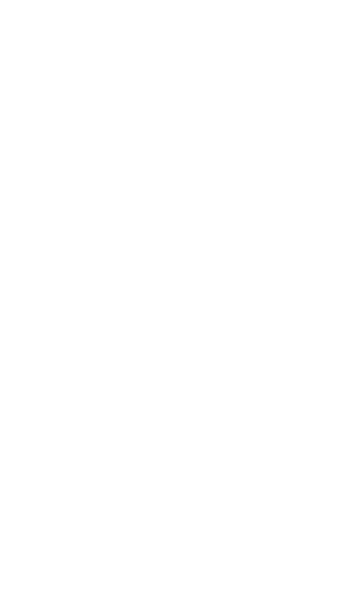

autoscale: true
footer: Helsing, London, IC Hack 2025

# [fit] **Macros** and Rust

#### Luke Tomlin, Helsing @ IC Hack 2025

---

# Synopsis

^ Also known as meta-programming, Macros are _code that write code_.

^ I'm sure you all remember your first time interacting with abstractions. Abstractions let us do more with less.

^ Inductive reasoning with Haskell, reasoning about loops, recursion. Taking a base-case, an inductive step... seems (and might still seem!) challenging at the time, but you get used to it after a little while.

^ Macros are that.. to the Nth degree. You're writing code, that writes code, that you can use in the code you write. Think about that for a sec.

---

# [fit] Rust + **Helsing**

^ So, a quick intro.

^ Helsing is a new type of defence company, operating out of Europe.

^ We focus on advanced applications of technology, particularly AI, within the defence space.

^ My name is Luke, and I'm (unsurprisingly) a software engineer here at Helsing. I also run hiring and staffing for engineering.

^ Rust is a modern systems programming language, which we primarily use and support. We're going to be seeing some of what makes Rust really cool in this presentation.

---

# Macros!

^ As I mentioned in the synopsis - today we're talking about macros. What are they, why should you care, how much damage can they do? We're going to cover all of this, with some fun examples and practical demonstrations.

---

# What is a **macro**?

^ Alright, let's start from basics. What is a macro?

^ A macro is a way of invoking the _creation of more code_ at compile time. It maps a rule, or pattern, (which YOU specify) of certain input into some replacement output.

^ Let's see a simple example of that in C..

---

```c
#define PI 3.14159

float circumference = 2 * PI * radius;
```

^ This perhaps one of the simplest ways a macro can be defined - in the resulting compiled code, PI here will be replaced literally with the number 3.14159.

^ This has performance benefits - indeed, in modern compilers this is often done automatically!

^ Next, we have another example..

---

```c
#define SQUARE(x) ((x) * (x))

int result = SQUARE(5); // This will expand to (5 * 5)
```

^ Something a little more abstract. Not particularly exciting - you save a layer of indirection with the function, but in terms of useability, you don't gain anything over a function call!

^ So, more generally, macros do something like this..

---


```
┌─────────────────┐            ┌─────────────────┐              ┌─────────────────┐
│                 │            │                 │              │                 │
│                 │            │                 │              │                 │
│  CODE + MACROS  ├pre-process─▶      CODE       ├───compile────▶  COMPILED CODE  │
│                 │            │                 │              │                 │
│                 │            │                 │              │                 │
└─────────────────┘            └─────────────────┘              └─────────────────┘
```

^ We have our code, we have some macros. These are preprocessed into code, then _that_ is compiled.

^ This is obviously a HUGE simplification, but it is the essentially correct.

---

# [fit] **Why** would you want a macro?
### Sounds dangerous.

^ Okay great you might say - so macros add the ability to generate arbitrary code at compile time. So?

^ Isn't this just, you know.. code? Mapping say, Java, into bytecode? 

---

It maps a **rule or pattern**, of certain input, into **some replacement output.**

before the rest of the code is compiled.

^ The beauty of macros is that they let you write _your own_ mapping. They are an _escape hatch_, letting you add your own language features and functionality!

---

# [fit] Why are macros **spicy**?

^ So, why are macros spicy?

^ Macros are that tool that you dread to give to your team. Precisely, _because_ macros give you so much power - they also let people express whatever they want.

^ If you've worked with people, you'll probably have already realised that this is a bad idea.

^ But they're also FUN because of this reason. There are so many possibilities!

---

# [fit] Macros in the wild.

^ So, what we've seen so far is super simple. You've likely seen other, more interesting, versions of this in the wild
Languages like Scala, Lisp (and other similar dialects), Elixir, C++ and so on, all have powerful macro systems.

^ Some other languages have things that are _like_ macros, but not.

---

```python
def log_decorator(func):
    def wrapper(*args, **kwargs):
        print(f"Calling function: {func.__name__}")
        result = func(*args, **kwargs)
        print(f"Function {func.__name__} returned: {result}")
        return result
    return wrapper

@log_decorator
def add(a, b):
    return a + b
```

^ Python has decorators, for example - it doesn't _have_ a compile step, so this happens at run time!

--- 

```clojure
(defmacro unless [condition & body]
  `(if (not ~condition)
     (do ~@body)))

;; Usage
(unless false
  (println "This will print because the condition is false."))

(unless true
  (println "This will not print because the condition is true."))
```

^ Clojure and other lisps famouly use macros for condiditional evaluation.

---

# [fit] So, you've chosen **chaos**.

^ So let's say you've decided that you want to use macros. Great!
You may have noticed that the previous examples were pretty simple - they were basically just functions with extra steps.
That's partially because I want them to fit on the slides, but also because when you want to get _really_
crazy, and you want to start defining your own rules, you need to be able to parse and interrogate the input to the macro.
Because, in _theory_, you could write a macro that understands well... anything!

---

```rust
run_my_macro! {
  bleep bloop
}
```

^ we could make something that turns this...
  
---

```rust
fn fizz_buzz() {
    for number in 1..=100 {
        match (number % 3 == 0, number % 5 == 0) {
            (true, true) => println!("FizzBuzz"),
            (true, false) => println!("Fizz"),
            (false, true) => println!("Buzz"),
            (false, false) => println!("{}", number),
        }
    }
}
```

^ into this!

^ This is the most extreme version of the macro - taking arbitrary patterns and defining rules on them.

^ This is complicated! Thankfully, being able to do this in Rust is well supported..

---

# [fit] Macros in **Rust**

^ Rust's approach is fundamentally very simple - it takes a _token stream_ and you return a _token stream_.
First - what's a token stream?

---

```rust
// my foo fn
pub fn foo(bar: u64) {
  
}
```

^ A token stream turns this...

--- 

```
[attr:docs "my foo fn"] -> [pub] -> [fn] -> [foo] ->
[open_paren] -> [bar] -> [colon] -> [u64] -> ...
```

^ Into this.
You'll _almost always_ in any real macro want to at least start from this level of abstraction (tokenisation).

---

# [fit] Macros in **Rust**

^ So what is the hello-world of Rust's macros?

---

```rust
#[proc_macro]
pub fn my_macro(tokens: TokenStream) -> TokenStream {
  // TODO
}
```

^ Simple, no?

---

# [fit] **Types** of macros in Rust

[.code-highlight: none]
[.code-highlight: 2]
[.code-highlight: 5-6]

```rust
fn foo() {
  let my_vec = vec![1, 2, 3]; // declarative macro
}

#[derive(Debug)] // attribute macro
struct Bar {
  
}
```
^ Rust actually presents a few different ways to make macros.
Declarative and attribute macros are simpler and more structured, but thus also less powerful.
You compromise _danger_ for expressivity. We're not going to cover either of these today.

---

# [fit] Practical demo

^ Show tokens->tokens, generate some simple code

---

# [fit] Okay, **dangerous**.
### but couldn't it be improved?

---

[.code-highlight: all]
[.code-highlight: 4]
[.code-highlight: 6-8]

```rust
#[proc_macro]
pub fn make_bark(items: TokenStream) -> TokenStream {
    // fancy Rust for "take the last element of the token-stream and stringify it"
    let bark_sound = items.into_iter().last().unwrap().to_string();

    format!("fn bark() {{ println!(\"{bark_sound}\"); }}")
        .parse()
        .unwrap()
}
```

^ Two ways this sucks right now - reading token-by-token is painful, and writing tokens sucks.
Lets fix writing tokens, first!

---

# [fit] Quasi-quoters

^ One variety of macros are called quasiquoters. Some of you might be familiar with them from Haskell!
They let you _write a different language_, in your target language.

---

[.code-highlight: all]
[.code-highlight: 3-5]
```rust
fn foo() {
  do_important_rust_things(1, 2, 3);
  run_my_macro! {
    bleep bloop
  }
}
````

^ we had a stupid version of this here - we've embedded our bloop language into normal Rust!

^ (bleep bloop not being valid Rust)

---

```js
const element = <h1>Hello, world!</h1>;
```
^ More seriously, you've all probably seen quasiquoters in real life.
JSX is a form of quasi-quotation - you're writing a superset of HTML, in your Javascript!

---

[.code-highlight: all]
[.code-highlight: 3]


```rust
use quote::quote;

let tokens: TokenStream = quote! {
  fn hello_world() {
    println!("hello, world!")
  }
};
```

^Rust comes with its own quasiquoter for macros, that lets you write _Rust in Rust_. CRAZY, I know. Except it's rust with some extra bits - it turns that Rust into a token stream!
...and THAT'S a macro, too!!

---

# [fit] Practical demo

^ Show quasiquoting

---

[.code-highlight: all]
[.code-highlight: 3]

```rust
#[proc_macro]
pub fn make_nice_bark(items: TokenStream) -> TokenStream {
    let bark_sound = items.into_iter().last().unwrap().to_string();

    quote! {
        fn nice_bark() {
            println!(#bark_sound);
        }
    }
    .into()
}
```

^ isn't that nicer! But getting that token still kinda sucks.

---

# [fit] **Unsucking** the token parsing.

^ So, before we do that, I want you to think about being the _user_ of a macro.

^ There's obviously two extremes to macros - small extensions to the host language, and totally self-defined sub-languages.

^ I mean, which is more legible?

---

```rust
  run_my_macro! {
    bleep bloop
  }
```

---

```rust
struct Foo {
  #[bleep(bloop)]
  bar: u32
}
```

^ Typically, people will want to write _Rust or almost Rust_ in their macro. This means that you're going to be _parsing Rust_ most of the time.

---

```rust
// my foo fn
pub fn foo(bar: u64) {
  
}
```

^ So, of course Rust comes with a built in AST parser!
We can use this to do interesting things, quickly.
It can turn the above, instead of into a token-stream as we saw at the beginning, into..

---

[.code-highlight: all]
[.code-highlight: 2-3]
[.code-highlight: 4-5]
[.code-highlight: 6-7]
[.code-highlight: 8-9]

```rust
ItemFn {
    // // my foo fn 
    attrs: [Attribute  { /* attr for docstrings */ }],
    // pub 
    vis: Visibility::Public(/* ... */),
    // fn foo(bar: u64)
    sig: Signature { /* fn signature info */ },
    // { ... }
    block: Box<Block { brace_token, stmts: Vec<Stmt> }>,
}
```

---

# [fit] Practical demo

^ So let's use this to clean up our hello-world example!
We've now ended up with the canonical "hello world!" of macros in Rust.

---

# [fit] Why is Rust's method **super powerful**?

^ What I've shown you is more than simply reading input and producing output. What I've not shown here is how this model:
Provides tracing (that is, tracing errors back to what created them), unrolling (turning one thing into multiple things), and a bunch of other features out of the box.
You can write things _incredibly complex_ with some degree of safety. Amazing!

--- 

# [fit] The possibilities are **endless**!

^ To wrap up this talk, I'm going to show you some of my favourite stupid-but-brilliant macros:

---

# [fit] Quasi-quoting **v2**

^ Show the weird language macro
https://github.com/bnjbvr/rouille

--- 

# [fit] Remember this slide?


```
┌─────────────────┐            ┌─────────────────┐              ┌─────────────────┐
│                 │            │                 │              │                 │
│                 │            │                 │              │                 │
│  CODE + MACROS  ├pre-process─▶      CODE       ├───compile────▶  COMPILED CODE  │
│                 │            │                 │              │                 │
│                 │            │                 │              │                 │
└─────────────────┘            └─────────────────┘              └─────────────────┘
```

--- 

# [fit] **Ludicrous** mode

^ those of you with particularly depraved minds will have realised that during this step, you can do _anything you want_.
Yes, including things with side-effects.
So, someone asked the question - what if, in my code, I just _describe what I want_, and then let ChatGPT write my code?
If you like non-determinism and madness, this is definitely where you want to be.

---


